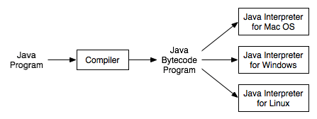

# 1. 자바의 이해

C++로 부터 발전한 언어이며, 썬 마이크로시스템즈에서 개발하여 1995년 5월 공식적으로 발표한 객체지향 프로그래밍 언어이다.

운영체제에 독립적이며, 자바로 작성된 프로그램은 JVM을 통해 운영체제의 종류에 관계없이 실행이 가능하다.

## 자바의 역사

1991년 썬 엔지니어들에 의해서 고안된 오크라는 언어에서부터 시작되었다. 처음에는 가전제품이나 소형 기기에 사용될 목적이었으나 인터넷이 등장하자 오크를 인터넷에 적합하도록 개발방향을 바꾸면서 이름도 자바로 변경하였다. 그 당시만 해도 자바로 작성된 Applet은 정적인 웹페이지에 멀티미디어적 요소를 제공할 수 있는 유일한 방법이었기 때문에 단기간에 많은 사용자층을 확보할 수 있었다.

## 자바의 특징

### 운영체제에 독립적이다.

Write Once Run Anywhere

JVM이 가능한 운영체제라면 어디서나 자바 프로그램에 동일한

실행환경을 제공하며 동일한 실행 결과 보여준다.

JAVA 프로그램의 코드는 확장명을  *.JAVA로 저장한다.

작성 코드는 java.exe로 컴파일하면 확장명 *.class인 바이트코드가 생성되고, 사람은 이파일의 내용을 읽을 수 없다.

### 객체지향언어이다.

객체지향개념의 특징인 상속, 캡슐화, 다형성이 잘 적용된 순수한 객체지향언어이다.

### 자동 메모리 관리

가비지 컬렉터가 자동적으로 메모리를 관리해주기 때문에 프로그래머는 메모리를 따로 관리하지 않아도 된다.

### 네트워크와 분산처리를 지원한다.

다양한 네트워크 프로그래밍 라이브러리를 통해 관련 프로그램을 쉽게 개발할 수 있다.

### 멀티쓰레드를 지원한다.

여러 쓰레드에 대한 스케줄링을 자바 인터프리터가 담당한다.

### 동적 로딩을 지원한다.

실행 시에 모든 클래스가 로딩되지 않고 필요한 시점에 클래스를 로딩해서 사용할 수 있다.

## JVM

자바로 개발한 프로그램을 컴파일하여 만들어지는 바이트코드를 실행시키기 위한 가상 머신이다.

