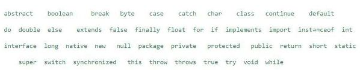
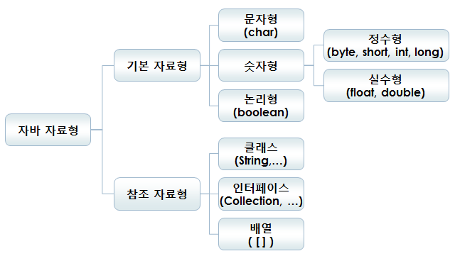

# 2. 변수

변수란 값을 저장할 수 있는 메모리상의 공간을 의미한다.

변수의 초기화란, 변수를 사용하기 전에 처음으로 값을 저장하는 것이다.

상수는 변수와 마찬가지로 값을 저장하는 공간이지만, 한 번 값을 지정하면 다른 값으로 변경할 수 없다.

리터럴은 그 자체로 값을 의미하는 것이다. 즉 final int month = 12 에서 상수는 month이고 리터럴은 12로 이해하면 된다. 

## 변수의 명명규칙

변수의 이름은 마음대로 지을 수 있지만, 자바에서는 다음과 같은 규칙을 지켜야 한다.

1. 대소문자가 구분되며 길이에 제한이 없다.
2. 변수명을 숫자로 시작해서는 안된다.
3. 특수문자는 _와 $만을 허용한다.
4. 예약어(키워드)를 사용해서는 안된다.

[자바의 예약어]



## Coding Convention

회사/조직마다 기본적인 코딩 컨벤션이 존재하지만, 구글에서 정리한 자바 스타일 가이드에 대해 링크를 별도로 첨부하였다.

[https://google.github.io/styleguide/javaguide.html](https://google.github.io/styleguide/javaguide.html)

다른 주요 프로그래밍 언어에 대한 구글 스타일 가이드 링크는 다음과 같다.

[https://google.github.io/styleguide/](https://google.github.io/styleguide/)

# 자료형



## 형변환

변수 또는 상수의 타입을 다른 타입으로 변환하는 것이다.

예를 들어 double num = 55.2 가 있다면, int number = (int)num으로 변환할 수 있다.

이를 캐스팅 연산자를 이용한 형변환(캐스팅)이라고 한다.

다만, 하기에 표시된 대로 자바 내 기본 method를 통한 형변환도 가능하다.

```java
//문자에서 숫자
string str = "10";
int number1 = Integer.parseInt(str);
int number2 = Integer.valueOf(str);
double number3 = Double.valueOf(str);
float number4 = Float.valueOf(str);

//숫자에서 문자
int num = 10;
double num2 = 10;
String str1 = String.valueOf(num);
String str2 = Integer.toString(num);
String str3 = Double.toString(num2);
```

형변환에 대한 참고사항은 다음과 같다.

1. boolean을 제외한 나머지 7개의 기본형은 서로 형변환이 가능하다.
2. 기본형과 참조형은 서로 형변환할 수 없다.
3. 서로 다른 타입의 변수간의 연산은 형변환을 하는 것이 원칙이지만, 값의 범위가 작은 타입에서 큰 타입으로의 형변환은 생략할 수 있다.