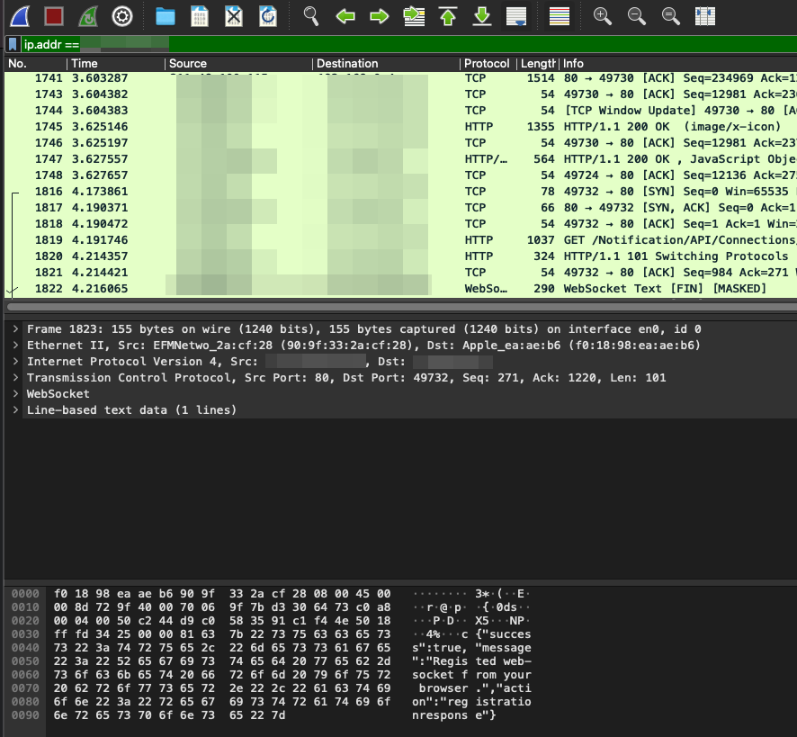
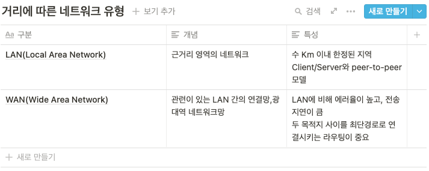

# 1장 네트워크 첫걸음

# 1. 네트워크의 구조

# 네트워크

임의의 연결망을 지칭하는 용어이며, 컴퓨터 용어에서는 두 대 이상 연결되어 있고, 주로 정보를 주고 받는 경로를 뜻한다.

# 패킷

네트워크를 통해 전송하기 쉽도록 자른 데이터의 작은 조각이다.

큰 데이터를 작은 패킷으로 분할해서, 데이터를 더 효과적이고 신뢰성 있게 보낼 수 있다.

분리된 각각의 패킷에는 별도의 번호가 붙여지고 목적지의 인터넷 주소가 기록되며, 에러 체크 데이터도 포함된다.

패킷의 크기는 일반적으로 최대 1500바이트이다. (MTU)

## 패킷의 구조

### 와이어샤크

서버 상호간 정상적으로 데이터를 주고 받는지 확인하기 위해 패킷 분석을 하는 프로그램이다.



네트워크의 흐름을 확인할 수 있고, 헤더 정보나 패킷 등을 확인할 수 있다. 

캡쳐화면을 보면 SYN, SYN + ACK, ACK의 3 Way HandShake 과정을 확인할 수 있다.

또한 서버로의 TCP Syn Flooding이나 Ping of Death, Land Attack등의 기본적인 네트워크 기반 공격 기술을 탐지할 수도 있다.

# 2. 정보의 양을 나타내는 단위

숫자 0과 1의 집합을 디지털 데이터라고 한다.

정보를 나타내는 최소 단위를 비트라고 하고, 8비트가 모이면 1바이트가 된다.

숫자와 문자의 대응표를 만들어 두고, 이를 문자 코드라고 하는데,

이 중에서 대표적인 문자 코드는 ASCII, 완성형, 조합형(유니코드) 등이 있다.

파이썬에서는 ord(), chr() 함수를 통해 문자를 아스키 코드로 반환해주고, 아스키 코드를 문자로 반환해주는 것을 지원한다.

```python
print(chr(73))    #결과는 J
print(ord("C"))   #결과는 67
```

# 3. LAN과 WAN

네트워크는 범위에 따라 크게 두 가지 종류로 나눌 수 있는데,

근거리(좁은 범위)의 LAN과 원거리(좀 더 넓은 범위)의 WAN이다.

일반적으로 건물 내부나 아파트 단지 내 네트워크 정도의 제한된 공간을 LAN으로 정의하고,

건물 간, 도시 간, 국가 간 등 보다 넓은 지역을 기간망을 통해 연결하는 것을 WAN으로 정의한다.




# 4. 가정 및 회사에서의 네트워크 구성

# 가정에서의 네트워크 구성

집에서 구성하는 네트워크는 앞서 서술했듯 랜이다. 집에서 인터넷을 사용하기 위해서는 인터넷 서비스 제공자(KT,SKT 등의 ISP)와 인터넷 회선(1G, 0.5G, 100Mbps 등)을 결정해야 한다.

또한 가정에서 네트워크를 구성하기 위해 인터넷 공유기가 필요하며, 연결 방식은 무선과 유선으로 나뉜다.

# 회사에서 하는 랜 구성

회사에서의 랜 네크워크는, 내부망으로 구성해서 외부와의 접근을 차단하는 경우가 일반적이나, 메일서버 등의 외부망과의 연결을 위해 DMZ가 존재한다.

DMZ를 구성함으로써 내부망의 보안을 구성할 수 있는데,

잘 알려진 포트인 FTP의 21,22 포트, 원격 지원의 3389 포트, DB의 1433이나 1521 포트 등을 그대로 외부에 노출시키면

외부에서 임의의 계정 정보를 이용한 Brute-Force Attack 등의 공격 기술을 통한 내부망으로의 접근이 용이해져 보안 취약점이 될 수 있다.

따라서, 서버를 직접적으로 외부에 노출시키는 것이 아니라 회사망 내에서 꼭 필요한 서비스만 외부에 노출시켜 주는 개념으로 이해할 수 있다.

회사에서는 상기 방식처럼 사내, 데이터 센터 등에 서버를 두고 운영하는 온프레미스 방식과, 최근에는 Azure, AWS 등의 클라우드에서도 서버를 두어 운영하고 있는데, 클라우드에서도 기본적인 DMZ 아키텍쳐를 구성 가능하며 이는 온프레미스 네트워크와 클라우드 기반 네트워크 간에 제한적으로 엑세스하여 VPN 등을 통해 네트워크를 연결하는 개념이다.
