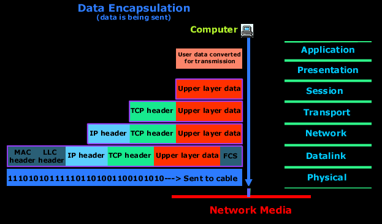
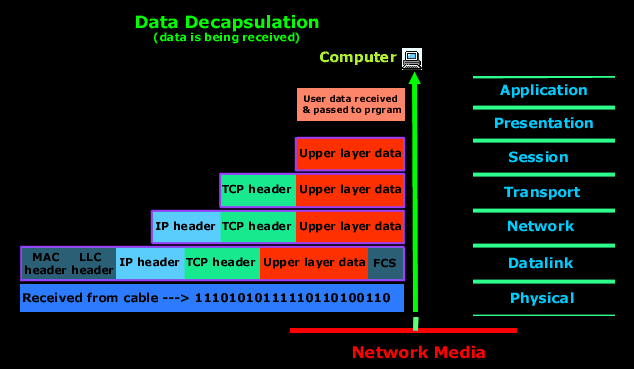

# 2장 네트워크의 기본 규칙

## 네트워크의 규칙

### 프로토콜

네트워크에서 문제없이 통신하기 위해서 지켜야되는 규칙(약속)

신호 체계, 인증, 오류 감지 및 수정 기능 등이 포함될 수 있다.

## OSI 7계층

국제표준기구(ISO) 에서 정한 데이터를 주고 받기 위한 통신 규격

## TCP/IP 4계층

4 Application Layer

3 Transport Layer

2 Internet Layer

1 Network Access Layer

## 캡슐화와 역캡슐화

### 정의

캡슐화 : 데이터를 보내는 쪽에서  데이터 앞부분에 전송하는 데 필요한 정보를 붙여야 하는데, 이 때 데이터 전달에 필요한 헤더를 붙여 나가는 것을 말한다.

역캡슐화 : 데이터를 받는 쪽에서 전송에 필요했던 헤더를 제거하는 것을 말한다.

## VPN

가상 통신 터널을 만들어 거점을 연결하여 통신하거나 외부에서 인터넷으로 내부망에 접속하는 것이다.

### 인터넷 VPN

거점 간 접속과 원격 접속 연결이 있다. 

거점 간 접속 : IPsec이라는 암호 기술 프로토콜을 사용하여 접속

원격 접속 연결 : 외부에서 사용하는 컴퓨터와 사내 네트워크를 연결하여 암호화된 통신로를 만든다.

### IP-VPN

MPLS 기술을 사용하며 인터넷망이 아닌 통신 사업자 전용 폐쇄망을 사용한다. 3자에 의한 해킹이나 데이터 변조의 위협에 대해 보다 안전하다.