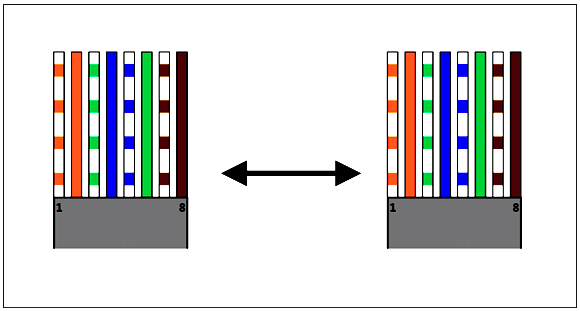
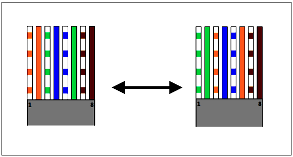

# 3장 물리 계층 (데이터를 전기 신호로 변환)

# 물리 계층의 역할과 랜 카드의 구조

OSI 계층 중에서 최하위 계층이다.

데이터를 전송하기 위해 시스템간의 물리적인 연결을 하고 전기 신호의 변환 및 제어하는 역할을 담당한다.

전기 신호의 종류에는 아날로그 신호와 디지털 신호가 있다.

아날로그 신호는 연속된 값을 가지고 있고, 디지털 신호는 비 연속적인 값을 가지고 있다.

데이터 송신 측 컴퓨터가 전송하는 0과 1의 비트열 데이터는 랜 카드를 통해 전기 신호로 변환되어 네트워크를 통해 수신 측 컴퓨터에 도착하고, 수신 측 컴퓨터에서는 전기 신호를 랜 카드를 통해 수신해서 0과 1의 비트열 데이터로 복원된다.

# 케이블의 종류와 구조

## 랜 케이블(트위스트 페어 케이블)

랜 케이블의 양쪽 끝에 RJ-45 커넥터가 붙어 있는데, 이 커넥터를 랜 포트 등에 연결한다.

### UTP 케이블

구리 선 여덟 개를 두 개씩 꼬아 만든 네 쌍의 전선으로 실드로 보호되어 있지 않음

실드는 차폐를 위한 금속 호일 같은 것으로 외부에서 발생하는 노이즈를 막는 역할을 한다.

UTP는 노이즈의 영향을 받기 쉽지만 저렴하기 때문에 일반적으로 많이 사용한다.

### STP 케이블

두 개씩 꼬아 만든 선을 실드로 보호한 케이블이다.

보편적으로 사용되지는 않는다.

### 다이렉트 케이블

구리선 여덟 개를 같은 순서로 커넥션에 연결한 케이블이다.

컴퓨터와 스위치를 연결할 때 사용한다.

### 크로스 케이블

한쪽 커넥터의 1번과 2번에 연결되는 커구리선을 다른쪽 커넥터 3번과 6번에 연결된 케이블이다.

컴퓨터 간 직접 랜 케이블로 연결할 때 사용한다.

# 리피터와 허브의 구조

## 리피터

전기 신호를 정형(복원)하고 증폭하는 기능을 가진 네트워크 중계 장비이다.

컴퓨터와 일대일 통신만 가능하다.

## 허브

리피터와 동일하게 전기 신호를 정형(복원)하고 증폭하는 기능을 가진다.

포트를 여러 개 가지고 있고 리피터 허브라고도 불린다.

컴퓨터 여러 대와 통신 가능하다.

특정 포트로부터 데이터를 받는다면 나머지 모든 포트로도 받은 데이터를 전송하는 특징이 있다.