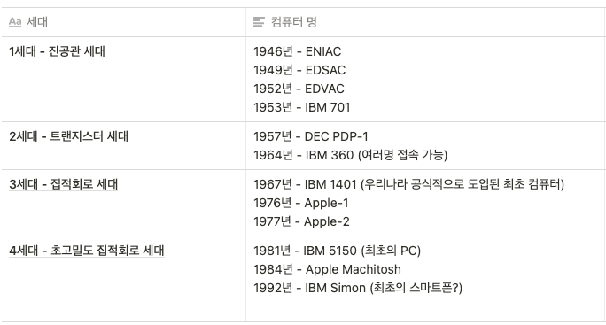

# 1장 컴퓨터 및 정보기술의 역사

## 이론적인 컴퓨터의 역사

수학 및 논리학적 컴퓨터의 토대는 1930년대 크게 발전했다. 이 때 학자들은 어떠한 문제를 나름대로의 명확한 수학적인 모델로 표현하는 방법을 개발하고, 알고리즘을 기술할 수 있는 컴퓨터에 대한 추상적 모델을 설계했다.

이 중 대표적인 문제는 정지 문제인데, 징지 문제는 프로그램을 설명한 것과 처음 입력값이 주어졌을 때, 이 프로그램에 입력값을 넣고 실행한다면 이 프로그램이 계산을 끝내고 멈출지 아니면 영원히 계속 계산할지 판정하라. 라고 요약할 수 있다.

앨런 튜링은 모든 가능한 입력값에 대해 정지문제를 풀 수 있는 일반적인 알고리즘이 존재하지 않는 것을 증명했다. 이 때 판정불가능하다는 것을 보이기 위해서 환원이라는 방법을 사용한다. 환원이라는 것은 '새로운 문제를 판정하는 방법이 있다면, 기존의 판정불가능한 문제의 모든 경우를 새로운 문제의 경우로 변환시켜서 기존의 판정불가능한 문제를 판정할 수 있다'는 것이다. 어떻게 하더라도 '예전' 문제를 풀 수 없기 때문에, 새로운 문제 역시 풀 수 없다. 이와 같은 과정으로 새로운 문제 역시 판정불가능하다는 것을 증명하였다.

## 기계식 컴퓨터의 역사

수천 년 전부터 사용되던 주판을 비롯해 17세기에는 기계식 계산기가 등장하였다. 19세기에 개발된 해석기관은 영국 수학 교수 찰스 배비지가 고안하였는데, 경제적 및 정치적, 법적 문제로 인해 실제 만들어지지는 않았다. 다만 논리적 설계 자체는 매우 현대적이었으며, 100년 뒤 첫 범용 컴퓨터의 모습인 입력장치, 출력장치, 처리장치, 저장장치를 포함하고 있다.

## 전자식 컴퓨터의 초기

제 2차 세계대전 중 개발되었던 ENIAC을 최초의 컴퓨터로 알고 있는 사람이 많으나, 1943년부터 1945년 사이에 영국의 암호 해독가들이 암호 해독을 위해 개발한 콜러서스가 세계 최초의 프로그래밍 가능한 전자 디지털 컴퓨터로 간주된다. 최초 컴퓨터에 대해서 명확하게 정의 내리는 것은 쉽지 않다. 20세기 후반에 미국 법원에서 ABC 컴퓨터가 인류 최초의 계산기라고 판결한 사례도 있다. 다만 대중들 사이에서는 ENIAC이 최초의 컴퓨터라고 알려져있고, 컴퓨터의 역사를 ENIAC의 탄생 시점으로 보는 경향이 많다.

## 근대적 컴퓨터의 역사

##### 컴퓨터의 연대기

### 프로그래밍의 등장

근대적 컴퓨터의 사용이 점점 확산됨에 따라, 기계어로 프로그래밍을 하는 불편함 때문에 사람이 프로그래밍하기 수월한 프로그래밍 언어의 필요성이 대두되기 시작했다. 이에 따라 숫자가 아닌 기호에 의해 컴퓨터의 정보를 표현하는 어셈블리 언어가 등장하게 되었다. 또한 사용자들은 표현하고자 하는 문제 자체에 더 가까운 언어가 필요하다고 생각하게 되었으며, 이에 따라 고급언어인 포트란이 생겼다. 또한 사무적인 정보를 처리하기 위해 코볼 언어도 개발되었다. 

1960년대에는 설계의 방법론이라 할 수 있는 소프트웨어 공학이 부각되었는데 이 때 가장 부각된 방법론은 구조적 프로그래밍 기법이다. 또한 이 시기에는 운영체계 및 데이터베이스 관리 시스템이 등장하였다.

1970년대에는 C 언어가 개발되었으며 UNIX 운영체제와 밀접하게 관련되어 급격하게 확산되었다.

1980년대에 C++이 1983년 발표되었다. C++은 C 언어에 객체지향 프로그래밍을 지원하기 위한 내용이 덧붙여진 것이라고 할 수 있다. 이로 인해 재사용성이 높은 소프트웨어의 개발을 이룰 수 있었다.

1990년대에는 당시 새로운 언어인 자바가 출현하였다. 1991년 제임스 고슬링이 만든 자바는 1995년 처음으로 공개되었고, "Write Once, Run Anywhere"를 모티브로 자바로 개발된 프로그램은 CPU나 운영 체제의 종류에 상관 없이 자바 가상 머신(JVM)을 설치할 수 있는 시스템에서는 어디서나 실행될 수 있었다. 

## 현대의 컴퓨터

현대의 컴퓨터는 규모에 따라 슈퍼컴퓨터, 워크스테이션, 개인용 컴퓨터, 휴대용 컴퓨터, 임베디드 컴퓨터 등의 분류가 있다.

슈퍼컴퓨터는 기상 예측, 통신망 설계 같은 분야에서 처리 능력이 월등히 뛰어난 컴퓨터라고 할 수 있다. 워크스테이션은 대형컴퓨터를 사용하기에는 규모가 작은 연구실이나 사무실에서 사용하기에 적절한 컴퓨터이다. 휴대용 컴퓨터는 랩탑 컴퓨터부터, 현재는 스마트폰이나 태블릿 컴퓨터까지 발전하고 있다. 임베디드 컴퓨터는 자동차, 냉장고 등 각종 기기에 내장되어 그 기능을 향상시키거나 처리하는 등의 업무를 담당한다.