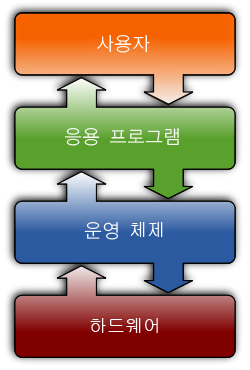

# 2장 운영체제 개요

## 운영체제의 정의

컴퓨터 하드웨어 바로 윗단에 설치되는 소프트웨어

메모리에 상주하는 운영체제의 부분을 커널이라고 하며, 이는 운영체제 중에서도 핵심적인 부분을 뜻한다.

## 운영체제의 기능

운영체제는 시스템 하드웨어를 관리하고, 응용 소프트웨어를 실행하기 위한 플랫폼과 서비스를 제공하는 시스템 소프트웨어이다.

즉, 운영체제의 주요 기능은 컴퓨터 시스템 내 자원을 효율적으로 관리하고 시스템을 편리하게 사용할 수 있는 환경을 제공하는 것이다.

그리고 운영체제는 보안을 위하여 특정 환경에 대한 권한을 사용자나 프로그램에 설정하고 인증 프로세스를 제공한다.

## 운영체제의 분류

### 싱글태스킹 운영 체제 / 멀티태스킹 운영 체제

싱글 태스킹 운영 체제는 한번에 오직 하나의 프로그램만 실행할 수 있으나 멀티 태스킹 운영 체제는 하나 이상의 프로그램이 동시에 실행할 수 있게 한다.

멀티태스킹의 경우 선점형과 협동형(비선점형)이 있다. 선점형 멀티태스킹의 경우 운영 체제는 CPU 시간을 쪼개어 프로그램들 각각에 슬롯을 할당해준다.

협동형 멀티태스킹은 정해진 방식에 따라 다른 프로세스들에 시간을 제공하기 위해 각 프로세스에 의존함으로써 수행된다.

### 단일 사용자 운영 체제 / 다중 사용자 운영 체제

단일 사용자 운영 체제는 사용자 구별이 없으나 여러 프로그램이 나란히 실행하는 것은 허용한다. 

다중 사용자 운영 체제는 디스크 공간과 같은 리소스와 프로세스를 식별하는 기능을 갖춘 멀티태스킹의 기본 개념을 확장하며, 여러 사용자에 속해 있으면서 여러 사용자가 동시에 시스템과 상호 작용할 수 있게 한다.

### 실시간 운영 체제

실시간 운영 체제는 특정한 짧은 시간 내에 이벤트나 데이터의 처리를 보증하는 운영 체제이다. 

Hard Realtime system은 주어진 시간을 지키지 못할 경우 위험한 결과를 초래할 수 있는 로켓, 원자로 제어 시스템을 말하며, Soft Realtime system은 스트리밍 시스템과 같이 데이터가 정해진 시간 단위로 전달되어야 올바른 기능을 수행할 수 있는 시스템이다.

## 운영체제의 예

### 유닉스

1969년 벨 연구소에서 최초로 개발된 것으로, 프로그램 개발 환경을 위해 설계된 운영체제이다.

이식성이 좋고, 커널 크기가 작으며 소스코드가 공개되어 있다.

### 리눅스

실제 유닉스 코드 없이 개발된 유닉스 계열 운영 체제이다. 슈퍼컴퓨터에서부터 손목시계에 이르기까지 다양한 기기에 쓰인다. 리눅스 커널은 오픈 소스 라이선스로 배포되므로 누구나 코드를 읽고 수정할 수 있다. 리눅스는 다양한 전자 기기에서 동작하도록 수정되고 있다.

### 윈도우

마이크로소프트 사에서 개발한 윈도우는 개인용 컴퓨터에 가장 흔히 쓰이는 운영 체제이다. 이전에 개발되었던 MS-DOS는 CUI 기반으로 초보자가 사용하기 어려웠기 때문에 좀 더 쉬운 사용을 위해 윈도우가 개발되게 되었다. 1985년 공개된 윈도우 1.0 버전을 시작으로 윈도우 95에서는 MS-DOS 위에서 구동되지 않고 그 자체로 온전한 운영체제가 되도록 제작되었으며, 2015년 윈도우 10이 출시되었다.

## 운영체제의 자원 관리 기능

### 하드웨어 자원

[CPU 스케줄링]
매 시점 어떠한 프로세스에 CPU를 할당해 작업을 처리할 것인지 결정하는 일이다.

FCFS(선입선출) 기법 : 맨 먼저 입력된 프로세스를 먼저 처리해주는 방식이다.

RR(라운드 로빈) 기법 : 프로세스가 CPU를 한 번 할당받아 사용할 수 있는 시간을 일정하게 고정된 시간으로 제한한다.

Priority(우선순위) 기법 : 대기중인 프로세스에 우선순위를 부여해서 우선순위가 높은 프로세스가 CPU를 먼저 획득하는 것이다.

[메모리 스케줄링]

고정분할 방식 : 물리적 메모리를 몇 개의 분할로 미리 나누어, 각각의 분할에 하나의 프로그램을 적재하게 된다. 분할이 고정적이기 때문에 분할 크기보다 크면 적재가 불가능하고, 분할 크기보다 작으면 남는 영역이 많이 발생하게 된다.

가변분할 방식 : 시점마다 프로그램 크기에 맞게 메모리를 분할하여 사용한다. 분할의 크기 때문에 큰 프로그램의 실행이 제한되지는 않으나, 물리적 메모리의 크기보다 더 큰 프로그램의 실행은 불가능하다.

가상메모리 기법 : 물리적 메모리보다 더 큰 프로그램은 보조기억장치에 저장해두었다가 필요할 때 적재하는 방식을 취한다. 이 때 사용되는 보조기억장치의 영역을 스왑 영역이라고 부른다.

[주변장치, 입출력 장치]

필요한 경우 신호를 발생시켜 서비스를 요청하는데, 이 때 발생시키는 신호를 인터럽트라고 한다.

예를 들어 사용자가 키보드 입력이 들어오면 키보드 컨트롤러가 인터럽트를 발생시켜 CPU에 작업을 요청하고, 그러면 CPU가 현재 수행 중이던 작업을 저장하고 인터럽트 요청을 처리한다.