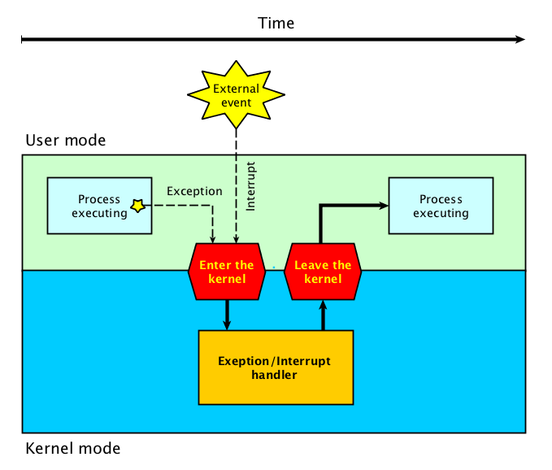
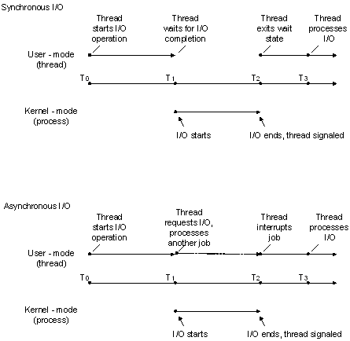
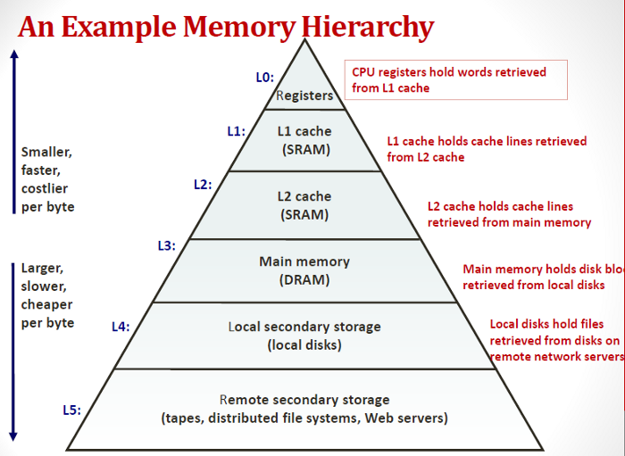

# 3장 컴퓨터 시스템의 동작 원리

## 컴퓨터 시스템의 구조

컴퓨터 내부장치 - CPU, 메모리

컴퓨터 외부장치 - 디스크, 키보드, 마우스, 모니터 등

메모리 및 입출력장치 등 각 하드웨어 장치에는 컨트롤러가 존재한다.

컨트롤러는 일종의 작은 중앙 처리 장치로서, 각 하드웨어 장치마다 존재하며 이들을 제어한다.

커널은 운영체제 중 항상 메모리에 올라가 있으며 가장 핵심적인 부분이다.

## CPU 연산과 I/O 연산

로컬 버퍼 : 각 장치마다 설치되어 있는 장치 컨트롤러에서 가지고 있으며 장치로부터 들어오고 나가는 데이터를 임시로 저장하기 위한 작은 메모리이다.

인터럽트 : 컨트롤러들이 CPU의 서비스가 필요할 때 이를 통보하는 방법이다.

## 인터럽트의 일반적 기능

통상적으로 인터럽트는 하드웨어 인터럽트를 의미하고, 소프트웨어 인터럽트는 트랩으로 불린다.

프로그램이 요청한 데이터를 로컬버퍼에서 읽어온 후 인터럽트 발생 시 CPU는 인터럽트 관련 업무를 수행한다.

예를 들어 디스크 컨트롤러가 인터럽트를 발생시키면 CPU는 하던 일을 잠시 멈추고 인터럽트 발생 시 수행하도록 정의된 코드를 찾아 수행한다.

인터럽트 처리를 완료하게 되면 원래 수행하던 작업으로 돌아가 중단된 일을 계속 수행한다.

시스템 콜이나 예외상황은 사용자 프로세스부터 CPU의 제어권이 운영체제에 전달되어 처리하는데, 이 과정에서 프로그램 코드가 직접 인터럽트 명령을 실행하여 인터럽트 발생 후 제어권이 넘어가게 된다.

## 인터럽트 핸들링

인터럽트가 발생한 경우 처리해야 할 일의 절차이다.

프로그램 A 실행 시 인터럽트가 발생하면 A의 현재 상태를 저장한다. CPU에서 명령이 실행될 때는 기존 레지스터 값이 지워지게 되므로 CPU 내 상태 저장이 필요하고, 모두 저장한 후에야 인터럽트 처리가 이루어질 수 있다.

운영체제는 현재 시스템 내 실행되는 프로그램을 관리하기 위해 PCB(프로세스 제어블록)라는 자료구조를 둔다. PCB는 각각 프로그램마다 하나씩 존재하며 해당 프로그램의 어느 부분이 실행 중이었는지 저장한다.

운영체제는 인터럽트가 발생했을 때에만 CPU의 제어권을 획득할 수 있다.

## 입출력 구조

입출력이란 컴퓨터 시스템이 컴퓨터 외부의 입출력 장치들과 데이터를 주고받는 것이다.

- 동기식 입출력 : 어떤 프로그램이 입출력 요청을 했을 때 입출력 작업 완료 후에야 프로그램이 후속 작업을 수행할 수 있는 방식

    입출력이 진행되는 동안 다음 명령을 수행하지 않고 기다린다.

- 비동기식 입출력 : 어떤 프로그램이 입출력 연산을 요청한 후에 연산이 끝나기를 기다리는 것이 아니라 CPU의 제어권을 입출력 연산을 호출한 프로그램에게 곧바로 다시 부여하는 방식이다.

## DMA

메모리는 원칙적으로 CPU에 의해서만 접근할 수 있으나, CPU 이외에 메모리 접근이 가능한 장치를 DMA(Direct Memory Access)라고 부른다.

일종의 컨트롤러로서, CPU가 입출력 장치들의 메모리 접근 요청에 의해 자주 인터럽트 당하는 것을 막아주는 역할이다.

DMA는 바이트 단위가 아닌 블록이라는 큰 단위로 정보를 메모리로 읽어온 후에 CPU에게 인터럽트를 발생시켜서 해당 작업의 완료를 알려준다. 이러한 방식으로 인터럽트의 빈도를 줄여 CPU를 조금 더 효율적으로 관리하고 입출력 연산을 빠르게 수행할 수 있다.

## 저장장치의 구조

- 주기억장치

    보통 메모리라고 부르며 전원이 나가면 저장되었던 내용이 사라져버리는 휘발성의 RAM을 사용한다.

- 보조기억장치
    1. 파일 시스템용 : 전원이 나가도 내용이 사라지지 않는 비휘발성이기 때문에, 계속 유지해야 할 정보를 저장할 때 사용한다.
    2. 스왑 영역 : 메모리 공간이 부족할 때 프로그램 수행에 당장 필요한 부분만 메모리에 올려놓고 그렇지 않은 부분을 스왑 영역에 저장한다.
- 저장장치의 계층 구조

상위 저장장치로 갈수록 접근 속도가 빠르지만 용량은 상대적으로 적다.

## 하드웨어의 보안

운영체제는 하드웨어적인 보안을 유지하기 위해서 커널모드와 사용자모드 두 가지 모드를 지원한다.

- 커널모드 : 운영체제가 CPU의 제어권을 가지고 운영체제 코드를 실행하는 모드로서, 모든 종류의 명령을 다 실행할 수 있다.
- 사용자모드 : 일반 사용자 프로그램이 실행되며 제한적인 명령만을 수행할 수 있다.

컴퓨터 시스템은 CPU 내부에 모드 비트를 두어 사용자 프로그램을 감시한다. 특권명령은 모드비트가 0일때만 수행 가능하고, 1일 때는 사용자모드로서 제한된 명령만을 수행할 수 있다.

CPU가 하나의 프로그램에서 독점되는 것에 대한 보호를 위해 운영체제는 타이머라는 하드웨어를 사용하고, 타이머는 정해진 시간이 지나면 인터럽트가 발생되어 운영체제가 CPU의 제어권을 획득할 수 있도록 하는 역할을 수행한다.

 

- 시스템 콜 : 사용자 프로그램이 I/O 행위를 하는 것은 특권명령이므로 직접 수행할 수 없다. 입출력 명령은 운영체제 코드에 구현되어 있으며, 사용자 프로그램은 직접 입출력을 수행하는 대신 운영체제에게 시스템 콜이라는 일종의 서비스 대행 요청을 하여 입출력을 수행한다. 시스템 콜이 디스크 입출력 요청이였으면 디스크 컨트롤러에게 입출력 요청을 수행하게 하고, 추후에 완료되면 CPU에게 인터럽트를 발생시켜 입출력이 완료되었음을 알려주고 해당 프로그램이 다시 CPU를 할당받을 수 있도록 한다.

### 멜트 다운

멜트다운 버그는 마이크로프로세서가 컴퓨터의 메모리의 전체를 볼 수 있도록 프로그램의 접속을 허용하며, 이로 인해서 전체 컴퓨터의 내용에 접근할 수 있다. 멜트다운은 캐시를 이용한 보안 취약점이며, 공격 프로그램은 커널의 특정 메모리 주소를 읽기 위해 직접적인 연관이 없는 RAM의 배열 전체를 무작위하게 확인한다. 그리고 특정 배열 내 주소가 읽기 속도가 빠른 경우에는 해당 부분이 캐시가 이용됐음을 확인하는 공격 방법이다. 

### 스펙터

스펙터는 프로그램을 속여 해당 프로그램의 메모리 공간 내 임의의 주소에 접근하도록 하는 취약점이다. 공격자는 이 취약점을 이용하여 데이터에 접근할 수 있고, 잠재적으로 민감한 데이터를 얻는데 활용할 수도 있다.

## 메모리 보안

하나의 사용자 프로그램이 메모리 주소 참조 연산을 잘못 사용해 다른 사용자 프로그램의 메모리 영역이나 운영체제 커널이 위치한 영역을 참조하려는 시도를 할 수 있는데, 이러한 문제를 해결하기 위해 하기 표시된 2개의 레지스터를 사용해서 프로그램이 접근하려는 메모리 부분이 합법적인지 체크하여 메모리를 보호할 수 있다.

기준 레지스터 : 어떤 프로그램이 수행되는 동안 프로그램이 합법적으로 접근할 수 있는 메모리 상의 가장 작은 주소를 보관한다.

한계 레지스터 : 기준 레지스터값으로부터 접근할 수 있는 메모리의 범위를 보관하고 있다.