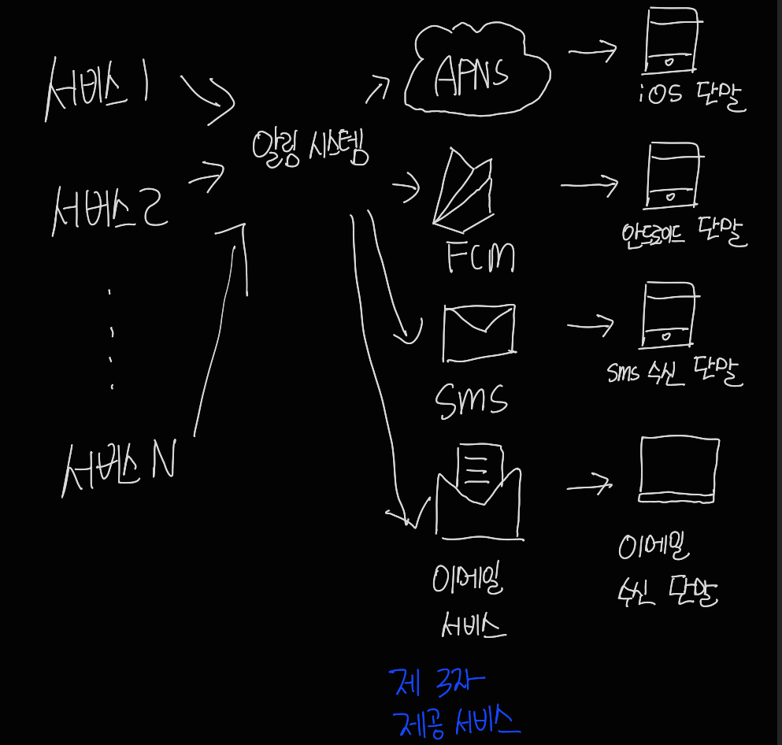
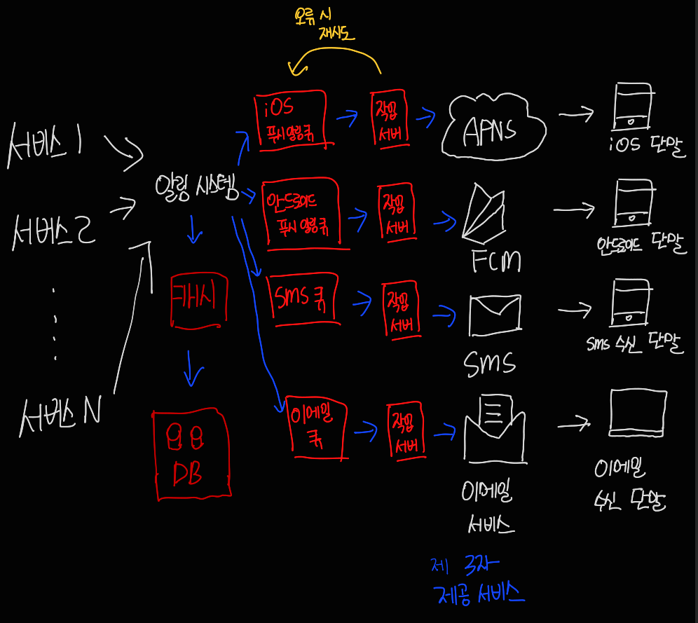
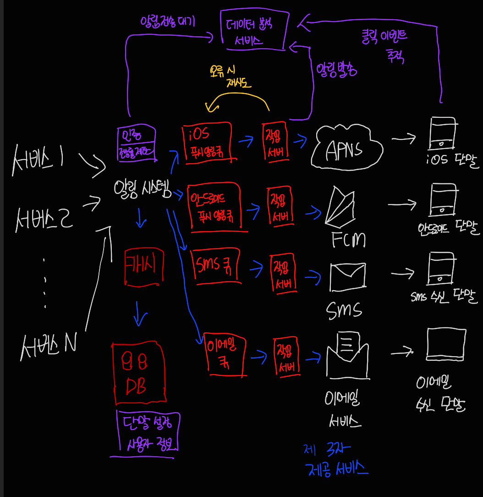

# 10장 알림 시스템 설계

알림 시스템은 고객에게 중요한 정보를 비동기로 제공한다.

알림 시스템은 단순히 모바일 푸시 알림에 한정되지 않고, 모바일 푸시 알림, SMS 메시지, 그리고 이메일 세 가지로 분류 할 수 있다.

## 1단계. 문제 이해 및 설계 범위 확정

이번 문제에 대해서 요구사항은 다음과 같다.

- 푸시 알림, SMS 메시지, 이메일 3가지 종류의 알림을 지원한다.
- 연성 실시간(soft real-time) 시스템이고, 알림은 빨리 전달되어야 하지만 약간의 지연은 가능하다.
- iOS, Android 단말, 랩톱/데스크톱을 지원해야 한다.
- 클라이언트 애플리케이션이나 서버 측에서 스케쥴링을 통해 사용자에게 보낼 알림을 만들 수 있다.
- 사용자가 알림을 받지 않도록 설정할 수 있어야 한다.
- 하루에 천만 건 모바일 푸시 알림, 백만 건 SMS 메시지, 5백만 건의 이메일을 보낼 수 있어야 한다.

## 2단계. 개략적 설계안 제시 및 동의 구하기

1단계를 만족하는 시스템의 개략적 설계안은 다음과 같다. 

### 알림 유형별 지원 방안

각각의 알림 메커니즘의 동작 방식은 다음과 같다.

#### iOS 푸시 알림

iOS에서 푸시 알림을 보내기 위해서는 세 가지 컴포넌트가 필요하다.

- 알림 제공자: 알림 요청을 만들어 푸시 알림 서비스로 보내는 주체이고, 알림 요청을 만들려면 다음과 같은 데이터가 필요하다.
  - 단말 토큰 : 알림 요청을 보내는 데 필요한 고유 식별자
  - 페이로드 : 일림 내용을 담은 JSON Dictionary
- APNS : 애플이 제공하는 원격 서비스. 푸시 알림을 iOS 장치로 보내는 역할
- iOS 단말 : 푸시 알림을 수신하는 사용자 단말

#### 안드로이드 푸시 알림

안드로이드 푸시 알림도 비슷한 절차로 전송되고, APNS 대신 FCM을 사용한다는 점만 다르다.

#### SMS 메시지

SMS 메시지를 보낼 떄는 제3 사업자의 서비스를 많이 이용하고, 이런 서비스는 상용 서비스라서 이용요금을 내야 한다.

#### 이메일

대부분의 회사가 고유 메일 서버를 구축할 역량을 갖추고 있지만, 많은 회사가 상용 이메일 서비스를 이용한다.

### 연락처 정보 수집 절차

알림을 보내려면 모바일 단말 토큰, 전화번호, 이메일 주소 등 정보가 필요하고 사용자가 앱 설치하거나 계정 등록 시 API 서버는 사용자의 정보를 수집하여 데이터베이스에 저장한다.

### 알림 전송 및 수신 절차

##### 개략적 설계안 (초안)

- 서비스 1 ~ 서비스 N : 서비스 각각은 마이크로서비스 일 수도 있고, cronjob 일 수 있고, 분산 시스템 컴포넌트 일수도 있다.
- 알림 시스템: 알림 시스템은 서비스 1 ~ 서비스 N에 알림 전송을 위한 API를 제공해야 하고, 제 3자 서비스에 전달할 알림 페이로드를 만들어 낼 수 있어야 한다.
- 제 3자 서비스 : 이 서비스들은 사용자에게 알림을 실제로 전달하는 역할을 한다.
- iOS, 안드로이드, SMS, 이메일 단말 : 사용자는 자기 단말에서 알림을 수신한다. 

이 설계에는 다음과 같은 문제가 있다.

- SPOF : 알림 서비스에 서버가 1개밖에 없다면, 서버에 장애가 생기면 전체 서비스의 장애로 이어질 수 있다.

- 규모 확장성 : 한 대 서비스로 푸시 알림에 관계된 모든 것을 처리하므로, DB, 캐시 등 중요 컴포넌트의 규모를 개별적으로 늘릴 방법이 없다.

- 성능 병목 : 알림을 처리하고 보내는 것은 자원을 많이 필요로 하는 작업일 수 있따.

##### 개략적 설계안 (개선된 버전)

다음과 같은 방향으로 개선할 수 있다.

- 데이터베이스와 캐시를 알림 시스템의 주 서버에서 분리한다.
- 알림 서버를 증설하고 수평적 규모 확장이 이루어질 수 있또록 한다.
- 메시지 큐를 이용해 시스템 컴포넌트 사이 강한 결합을 끊는다.

- 알림 서버는 다음과 같은 기능을 제공한다.
  - 알림 전송 API : 사내 서비스 또는 인증된 클라이언트만 이용 가능하다.
  - 알림 검증 : 이메일 주소, 전화번호 등에 대한 기본적 검증을 수행한다.
  - 데이터베이스 또는 캐시 질의 : 알림에 포함시킬 데이터를 가져오는 기능이다.
  - 알림 전송 : 알림 데이터를 메시지 큐에 넣는다.
- 캐시 : 사용자 정보, 단말 정보, 알림 템플릿 등을 캐시한다.
- 데이터베이스 : 사용자, 알림, 설정 등 다양한 정보를 저장한다.
- 메시지 큐 : 시스템 컴포넌트 간 의존성을 제거하기 위해 사용한다.
- 작업 서버 : 메시지 큐에서 전송할 알림을 꺼내서 3자 서비스로 전달하는 역할을 담당한다.

상기 컴포넌트는 다음과 같은 절차로 알림을 보낸다.

1. API를 호출하여 알림 서버로 알림을 보낸다.

2. 알림 서버는 사용자 정보, 단말 토큰과 같은 메타데이터를 캐시나 데이터베이스에서 가져온다.

3. 알림 서버는 알림에 맞는 이벤트를 만들어서 해당 이벤트를 큐에 넣는다.

4. 작업 서버는 메시지 큐에서 알림 이벤트를 꺼낸다.

5. 작업 서버는 알림을 제3자 서비스로 보낸다.

6. 제3자 서비스는 사용자 단말로 알림을 전송한다.

   

## 3단계. 상세 설계

### 안정성

분산 환경에서 운영될 알림 시스템을 설계할 때는 안정성을 확보하기 위한 사항을 고려해야 한다.

##### 데이터 손실 방지

어떤 상황에도 알림이 소실되면 안되기 때문에, 알림 로그 데이터베이스를 유지하는 것이 방법이다.

##### 알림 중복 전송 방지

같은 알림이 여러 번 반복되는 것을 완전히 막는 것은 불가능하다. 하지만 빈도를 줄이려면 중복을 탐지하는 메커니즘을 도입하고, 오류를 신중하게 처리해야 한다.

### 추가로 필요한 컴포넌트 및 고려사항

##### 알림 템플릿

대형 알림 시스템은 수백만 건 이상의 알림을 처리하며, 템플릿은 사전에 지정한 형식에 맞춰 알림을 만들어 내는 틀이다.

ex) 본문 : [item_name] 이 다시 입고 되었습니다. [date] 까지만 주문 가능합니다.

##### 알림 설정

사용자는 알림에 대해 피곤함을 느끼기 때문에, 많은 웹사이트와 앱에서는 사용자가 알림 설정을 상세히 조정할 수 있도록 하고 있다.

##### 전송률 제한

사용자에게 많은 알림을 보내지 않도록 하는 방법은, 사용자가 받을 수 있는 알림의 빈도를 제한하는 것이다.

##### 재시도 방법

제 3자 서비스가 알림 전송에 실패하면, 알림을 재시도 전용 큐에 넣고 같은 문제가 계속 발생하면 개발자에게 통지한다.

##### 푸시 알림과 보안

iOS, 안드로이드 앱의 경우 알림 전송 API는 appKey 등으로 보안을 유지하여 인증된 클라이언트만 API를 사용하여 알림을 보낼 수 있다.

##### 큐 모니터링

알림 시스템을 모니터링 할 때 중요한 것 중 하나는 큐에 쌓인 알림의 개수이다.

##### 이벤트 추적

알림 확인율, 클릭율, 실제 앱 사용 등의 메트릭은 사용자를 이해하는 데 중요하다. 따라서 알림 시스템을 만들면 데이터 분석 서비스와도 통합해야 한다.

#### 수정된 설계안

- 알림 서버에 인증(authentication)과 전송률 제한(rate-limiting) 기능이 추가 되었다.
- 전송 실패에 대응하기 위한 재시도 기능이 추가되었다. 전송에 실패한 알림은 다시 큐에 넣고 지정된 횟수만큼 재시도한다.
- 전송 템플릿을 사용하여 알림 생성 과정을 단순화하고 알림 내용의 일관성을 유지한다.
- 모니터링과 추적 시스템을 추가하여 시스템 상태를 확인하고 추후 시스템을 개선하기 쉽도록 하였다

## 4단계. 마무리

규모 확장이 쉬울 뿐 아니라 푸시 알림, SMS 메시지, 이메일 등 다양한 정보 전달 방식을 지원하는 알림 시스템을 설계했다. 시스템 컴포넌트 사이의 결합도를 낮추기 위해 메시지 큐를 적극적으로 사용하였으며, 각 컴포넌트의 구현 방법과 최적화 기법에 대해서도 심도 있게 알아보았다. 특히 아래 주제에 집중하였다.

- 안정성(reliability): 메시지 전송 실패율을 낮추기 위해 안정적인 재시도 메커니즘을 도입하였다.
- 보안(security): 인증된 클라이언트만이 알림을 보낼 수 있도록 appKey, appSecret 등의 메커니즘을 이용하였다.
- 이벤트 추적 및 모니터링: 알림이 만들어진 후 성공적으로 전송되기까지의 과정을 추적하고 시스템 상태를 모니터링하기 위해 알림 전송의 각 단계마다 이벤트를 추적하고 모니터링할 수 있는 시스템을 통합하였다.
- 사용자 설정: 사용자가 알림 수신 설정을 조정할 수 있도록 하였다. 따라서 알림을 보내기 전 반드시 해당 설정을 확인하도록 시스템 설계를 변경하였다.
- 전송률 제한: 사용자에게 알림을 보내는 빈도를 제한하였다.