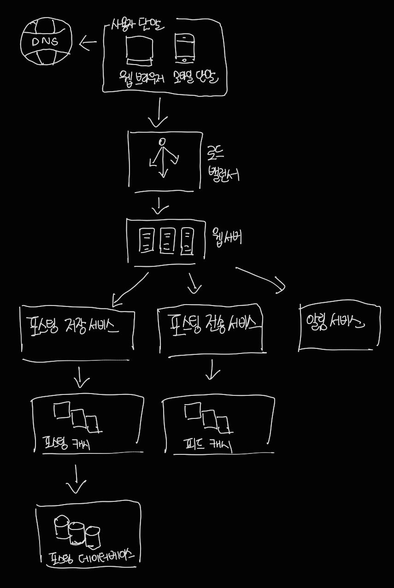
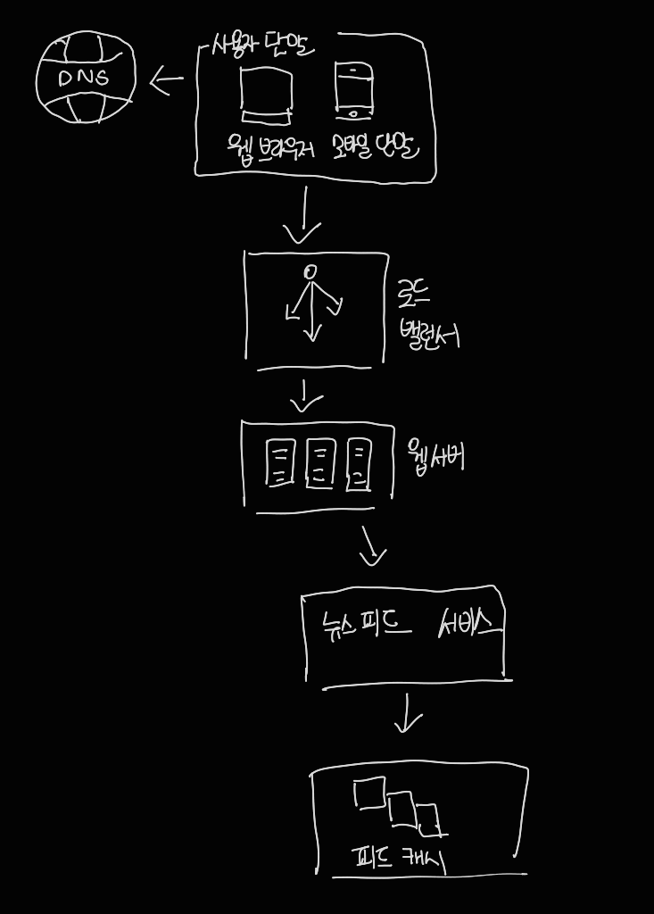

# 11장 뉴스 피드 시스템 설계

뉴스 피드는 홈페이지 중앙에 지속적으로 업데이트되는 스토리이다. 

페이스북 같은 경우 사용자 상태, 사진, 비디오, 링크, 앱 활동, 페이스북에서 팔로하는 사람들, 페이지, 또는 그룹으로부터 나오는 좋아요 등을 포함한다.

## 1단계. 문제 이해 및 설계 범위 확정

이번 문제에 대해서 요구사항은 다음과 같다.

- 모바일 앱과 웹 둘 다 지원해야 한다.

- 사용자가 뉴스 피드 페이지에 새로운 스토리를 올리고, 친구들이 올리는 스토리도 볼 수 있어야 한다.

- 시간 흐름 역순으로 스토리가 표시된다.

- 한 명의 사용자는 최대 5천명의 친구를 가질 수 있다.

- 트래픽 규모는 매일 천만 명이 방문한다. (천만 DAU)

- 스토리에는 이미지나 비디오 등 미디어 파일이 포함될 수 있다.

  

## 2단계. 개략적 설계안 제시 및 동의 구하기

지금부터 살펴볼 설계안은 피드 발행, 뉴스 피드 생성의 두 가지 부분으로 나뉘어 있다.

- 피드 발행 : 사용자가 스토리를 포스팅하면 해당 데이터를 캐시와 데이터베이스에 기록한다. 새 포스팅은 친구의 뉴스 피드에도 전송된다.
- 뉴스 피드 생성 : 뉴스 피드는 모든 친구의 포스팅을 시간 흐름 역순으로 모아서 만든다고 가정한다.

### 뉴스 피드 API

뉴스 피드 API는 클라이언트가 서버와 통신하기 위해 사용하는 수단이다. HTTP 프로토콜 기반이고, 상태 정보를 업데이트하거나, 뉴스 피드를 가져오거나, 친구를 추가하는 등 다양한 작업을 수행하는 데 사용한다.

#### 피드 발행 API

새 스토리를 포스팅하기 위한 API다. HTTP POST 형태로 요청을 보내면 된다. 다음과 같은 형태를 띈다.

POST /v1/me/feed

​	Parameter

- Body: 포스팅 내용
- Authorization 헤더 : API 호출을 인증하기 위해 사용한다.

#### 피드 읽기 API

뉴스 피드를 가져오는 API다. 다음 형태를 띈다.

GET /v1/me/feed

​	Parameter

- Authorization 헤더 : API 호출을 인증하기 위해 사용한다.

### 피드 발행

피드 발행 시스템의 개략적 형태는 다음과 같다.

· 사용자: 모바일 앱이나 브라우저에서 새 포스팅을 올리는 주체다. POST /v1/me/feed API를 사용한다.
· 로드밸런서(load balancer): 트래픽을 웹 서버들로 분산한다.
· 웹 서버: HTTP 요청을 내부 서비스로 중계하는 역할을 담당한다.
· 포스팅 저장 서비스(post service): 새 포스팅을 데이터베이스와 캐시에 저장한다.
· 포스팅 전송 서비스(fanout service): 새 포스팅을 친구의 뉴스 피드에 푸시 (push)한다. 뉴스 피드 데이터는 캐시에 보관하여 빠르게 읽어갈 수 있도록 한다.
· 알림 서비스(notification service): 친구들에게 새 포스팅이 올라왔음을 알리거나, 푸시 알림을 보내는 역할을 담당한다.

### 뉴스 피드 생성

피드 발행 시스템의 개략적 형태는 다음과 같다.

· 사용자: 뉴스 피드를 읽는 주체다. GET /v1/me/feed API를 이용한다.
· 로드 밸런서: 트래픽을 웹 서버들로 분산한다.
· 웹 서버: 트래픽을 뉴스 피드 서비스로 보낸다.
· 뉴스 피드 서비스(news feed service): 캐시에서 뉴스 피드를 가져오는 서비 스다.
· 뉴스 피드 캐시(news feed cache): 뉴스 피드를 렌더링할 때 필요한 피드 ID 를 보관한다.

## 3단계. 상세 설계

### 피드 발행 흐름 상세 설계

이번 파트에서는 웹 서버와 포스팅 전송 서비스에 초점을 맞췄다.

#### 웹 서버

웹 서버는 클라이언트와 통신할 뿐 아니라 인증이나 처리율 제한 등의 기능도 수행한다. 

올바른 인증 토큰을 Authorization 헤더에 넣고 API를 호출하는 사용자만 포스팅을 할 수 있어야 한다. 

또한, 스팸을 막고 유해한 콘텐츠가 자주 올라오는 것을 방지하기 위해서 특정 기간 동안 한 사용자가 올릴 수 있는 포스팅의 수에 제한을 두어야 한다

#### 포스팅 전송 서비스

포스팅 전송, 즉 팬아웃(fanout)은 어떤 사용자의 새 포스팅을 그 사용자와 친구 관계에 있는 모든 사용자에게 전달하는 과정이다. 

팬아웃에는 두 가지 모델이 있다. 

- 쓰기 시점에 팬아웃(fanout-on-write)하는 모델(푸시 push모델이라고도 함)

  **새로운 포스팅을 기록하는 시점에 뉴스 피드를 갱신**하게 된다. 다시 말해, 포스팅이 완료되면 바로 해당 사용자의 캐시에 해당 포스팅을 기록하는 것이다.
  장점
  · 뉴스 피드가 실시간으로 갱신되며 친구 목록에 있는 사용자에게 즉시 전송 된다.
  · 새 포스팅이 기록되는 순간에 뉴스 피드가 이미 갱신되므로(pre-computed) 뉴스 피드를 읽는 데 드는 시간이 짧아진다.
  단점
  · 친구가 많은 사용자의 경우 친구 목록을 가져오고 그 목록에 있는 사용자 모두의 뉴스 피드를 갱신하는 데 많은 시간이 소요될 수도 있다.
  · 서비스를 자주 이용하지 않는 사용자의 피드까지 갱신해야 하므로 컴퓨팅 자원이 낭비된다.

- 읽기 시점에 팬아웃(fanout-on-read)하는 모델(풀 pull 모델이라고도 함)

  **피드를 읽어야 하는 시점에 뉴스 피드를 갱신**한다. 따라서 요청 기반(on-demand) 모델이다. 사용자가 본인 홈페이지나 타임 라인을 로딩하는 시점에 새로운 포스트를 가져오게 된다.
  장점
  · 비활성화된 사용자, 또는 서비스에 거의 로그인하지 않는 사용자의 경우에는 이 모델이 유리하다. 로그인하기까지는 어떤 컴퓨팅 자원도 소모하지 않아서다.
  · 데이터를 친구 각각에 푸시하는 작업이 필요 없으므로 핫키 문제도 생기지 않는다.
  단점
  · 뉴스 피드를 읽는 데 많은 시간이 소요될 수 있다.

본 설계안의 경우는 두 가지 방법을 융합하는 전략을 취한다.

뉴스 피드를 빠르게 가져올 수 있도록 하는 것은 아주 중요하므로 **대부분의 사용자**에 대해서는 **푸시 모델을 사용**한다. 

**친구나 팔로어(follower)가 아주 많은 사용자**의 경우에는 팔로어로 하여금 해당 사용 자의 포스팅을 필요할 때 가져가도록 하는 **풀 모델을 사용**하여 시스템 과부하를 방지할 것이다. 

아울러 안정 해시(consistent hashing)를 통해 요청과 데이터를 보다 고르게 분산하여 핫키 문제를 줄여볼 것이다.

1. 그래프 데이터베이스에서 친구 ID 목록을 가져온다. 그래프 데이터베이스는 친구 관계나 친구 추천을 관리하기 적합하다. 

2. 사용자 정보 캐시에서 친구들의 정보를 가져온다. 그런 후에 사용자 설정에 따라 친구 가운데 일부를 걸러낸다. 예를 들어 여러분이 친구 중 누군가의 피드 업데이트를 무시하기로 설정했다면(mute) 친구 관계는 유지될지 언정 해당 사용자의 새 스토리는 여러분의 뉴스 피드에 보이지 않아야 한다. 새로 포스팅된 스토리가 일부 사용자에게만 공유되도록 설정된 경우에도 비슷한 일이 벌어질 것이다.

3. 친구 목록과 새 스토리의 포스팅 ID를 메시지 큐에 넣는다.

4. 팬아웃 작업 서버가 메시지 큐에서 데이터를 꺼내어 뉴스 피드 데이터를 뉴스 피드 캐시에 넣는다. 

   사용자 정보와 포스팅 정보 전부를 이 테이블에 저장하지 않는 이유는, 그렇게 하면 메모리 요구량이 지나치게 늘어날 수 있기 때문이다. 따라서 ID 만 보관한다. 

   또한 메모리 크기를 적정 수준으로 유지하기 위해서, 이 캐시의 크기에 제한을 두며, 해당 값은 조정이 가능하도록 한다. 어떤 사용자가 뉴스 피드에 올라온 수천 개의 스토리를 전부 훑어보는 일이 벌어질 확률은 지극히 낮다. 대부분의 사용자가 보려 하는 것은 최신 스토리다.

### 피드 읽기 흐름 상세 설계

이미지나 비디오와 같은 미디어 콘텐츠는 CDN에 저장하여 빨리 읽어갈 수 있도록 하였다. 이제 클라이언트가 뉴스 피드를 어떻게 읽어 가는지 단계별로 알아보자.
1. 사용자가 뉴스 피드를 읽으려는 요청을 보낸다. 요청은 /v1/me/feed로 전송될 것이다.
2. 로드밸런서가 요청을 웹 서버 가운데 하나로 보낸다.
3. 웹 서버는 피드를 가져오기 위해 뉴스 피드 서비스를 호출한다.
4. 뉴스 피드 서비스는 뉴스 피드 캐시에서 포스팅 ID 목록을 가져온다.
5. 뉴스 피드에 표시할 사용자 이름, 사용자 사진, 포스팅 콘텐츠, 이미지 등을 사용자 캐시와 포스팅 캐시에서 가져와 완전한 뉴스 피드를 만든다.
6. 생성된 뉴스 피드를 JSON 형태로 클라이언트에게 보낸다. 클라이언트는 해당 피드를 렌더링한다.

### 캐시 구조

본 설계안의 경우에는 캐시를 다섯 계층으로 나눈다.

| 계층                |             |             |      |
| ------------------- | ----------- | ----------- | ---- |
| **뉴스 피드**       | 뉴스 피드   |             |      |
| **콘텐츠**          | 인기 콘텐츠 | 일반 콘텐츠 |      |
| **소셜** **그래프** | 팔로어      | 팔로잉      |      |
| **행동**            | 좋아요      | 답글        | 기타 |
| **횟수**            | 좋아요 횟수 | 답글 횟수   | 기타 |

· 뉴스 피드: 뉴스 피드의 ID를 보관한다.
· 콘텐츠: 포스팅 데이터를 보관한다. 인기 콘텐츠는 따로 보관한다.
· 소셜 그래프: 사용자 간 관계 정보를 보관한다.
· 행동(action): 포스팅에 대한 사용자의 행위에 관한 정보를 보관한다. 포스 팅에 대한 ‘좋아요’, 답글 등등이 이에 해당한다.
· 횟수(counter): ‘좋아요’ 횟수, 응답 수, 팔로어 수, 팔로잉 수 등의 정보를 보관한다.

## 4단계. 마무리

설계를 마친 후 규모 확장성 이슈를 논의하는 것도 좋다. 

이 책의 다른 부분에서 논의한 내용과 겹칠 수 있어서, 다루면 좋을 만한 주제만 아래에 몇 가지 나열해 보았다.

###### 데이터베이스 규모 확장

· 수직적 규모 확장 vs 수평적 규모 확장
· SQL vs NoSQL
· 주-부(master-slave) 다중화
· 복제본(replica)에 대한 읽기 연산
· 일관성 모델(consistency model)
· 데이터베이스 샤딩(sharding)

###### 이 외에도 논의해 보면 좋을 만한 주제로는 다음과 같은 것이 있다.

· 웹 계층(web tier)을 무상태로 운영하기
· 가능한 한 많은 데이터를 캐시할 방법
· 여러 데이터 센터를 지원할 방법
· 메시지 큐를 사용하여 컴포넌트 사이의 결합도 낮추기
· 핵심 메트릭(key metric)에 대한 모니터링. 예를 들어 트래픽이 몰리는 시간 대의 QPS(Queries per Second), 사용자가 뉴스 피드를 새로고침(refresh) 할때의 지연시간