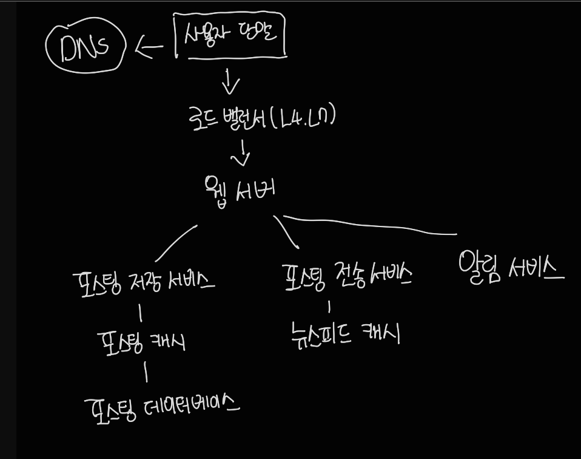
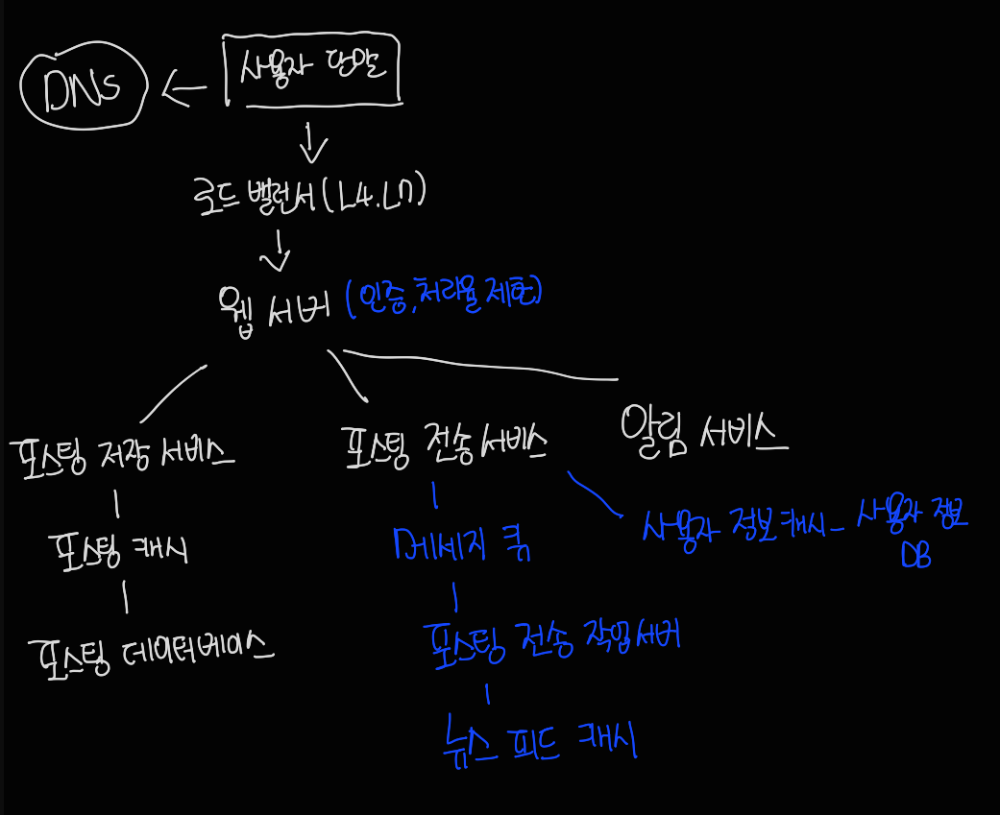

# 3장 시스템 설계 면접 공략법

시스템 설계 면접은 동료가 모호한 문제를 풀기 위해 협력하여 해결책을 찾아내는 과정에 대한 시뮬레이션이다.

정해진 결말도 정답도 없다.

시스템 설계 면접은 단순히 기술적 측면을 평가하는 자리 뿐만 아니라, 협력에 적합한 사람인지, 압박이 심한 상황도 잘 헤쳐나갈 수 있는지, 모호한 문제를 건설적으로 해결할 수 있는지도 같이 평가한다.

 

### 1) 효과적 면접을 위한 4단계 접근법

##### 1단계 문제 이해 및 설계 범위 확정

생각 없이 바로 답을 내서는 좋은 점수를 받기 힘들고, 부정적 신호이다.

바로 답부터 들이밀지 말고 속도를 늦춰서 깊이 생각하고 질문하여 요구사항과 가정을 분명히 하라.

최종 설계를 바로 내놓으면 잘못된 시스템을 설계할 가능성이 높아진다.

올바른 질문을 하고 적절한 가정을 하고 시스템 구축에 필요한 정보를 모아야 한다.

요구사항을 이해하고 모호함을 없애는 것이 중요하다.

- 구체적으로 어떤 기능들을 만들어야 하나?
- 제품 사용자 수는 얼마나 되나?
- 회사의 규모는 얼마나 빨리 커지리라 예상하나?
- 화사가 주로 사용하는 기술 스택과 설계를 단순화하기 위해 활용할 수 있는 서비스가 있는가?

##### 2단계 개략적인 설계얀 제시 및 동의 구하기

설계안에 대한 최초 청사진을 제시하고 의견을 구하라

화이트보드나 종이에 핵심 컴포넌트를 포함하는 다이어그램을 그려라

최초 설계안이 시스템 규모에 관계된 제약사항들을 만족하는지를 개략적으로 계산해 보라

###### 예제

##### 3단계 상세 설계

- 시스템에서 전반적으로 달성해야 할 목표와 기능 범위 확인
- 전체 설계의 개략적 청사진 마련
- 해당 청사진에 대한 면접관의 의견 청취
- 상세 설계에서 집중해야 할 영역들 확인

특정 시스템 컴포넌트들의 세부 사항을 깊이 있게 설명하는 것을 보길 원한다.

시간 관리에도 주의를 기울여야 한다.

###### 예제

##### 4단계 마무리

시스템 병목구간, 개선 가능한 지점을 찾아내라고 할 때 비관적 사고 능력을 보이고 좋은 인상을 위해 개선할 점을 확인하라

설계를 다시한번 요약하는 것도 도움이 된다.

오류가 발생하면 무슨 일이 생길 지 따져보는 것도 필요하다.

운영 이슈도 논의할 가치가 있다.

규모 확장 요구에 어떻게 대처할 지도 필요하다.

시간이 있다면, 세부적 개선사항들을 제안할 수 있다.

##### 해야 할 것

질문을 통해 확인하라. 스스로 내린 가정이 옳다 믿고 진행하지 말라

문제의 요구사항을 이해하라

정답이나 최선의 답안은 없다는 것을 명심하라. 규모에 따라 설계안이 달라질 수 있으며, 요구사항을 정확하게 이해했는지 다시 확인하라.

면접관이 사고 흐름을 이해할 수 있도록 소통하라

가능하다면 여러 해법을 제시하라

개략적 설계에 면접관이 동의하면, 컴포넌트의 세부사항을 설명하기 시작하라.

면접관의 아이디어를 이끌어 내라

포기하지 말라

##### 하지 말아야 할 것

전형적인 면접 문제들에도 대비하지 않은 상태에서 면접장에 가지 말라

요구사항이나 가정들을 분명히 하지 않은 상태에서 설게를 제시하지 말라

처음부터 세부사항을 깊이 설명하지 말고, 개략적 설계를 마친 뒤에 세부사항으로 나아가라

진행 중 막혔다면, 힌트를 청하기를 주저하지 말라

소통을 주저하지 말라, 침묵 속에 설계를 진행하지 말라

설계안을 내놓는 순간 면접이 끝났다고 생각하지 말라. 끝날 때 까지는 끝난 것이 아니고, 의견을 자주 구하라

##### 시간 배분

45분의 시간이 주어진다고 가정하면,

1단계 - 문제 이해 및 설계 범위 확정 : 3분에서 10분

2단계 - 개략적 설계안 제시 및 동의 구하기 : 10분에서 15분

3단계 - 상세 설계 : 10분에서 25분

4단계 - 마무리 : 3분에서 5분