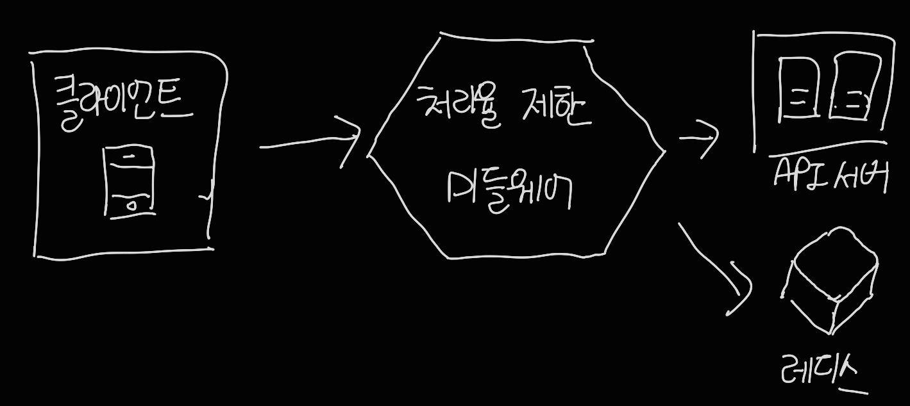
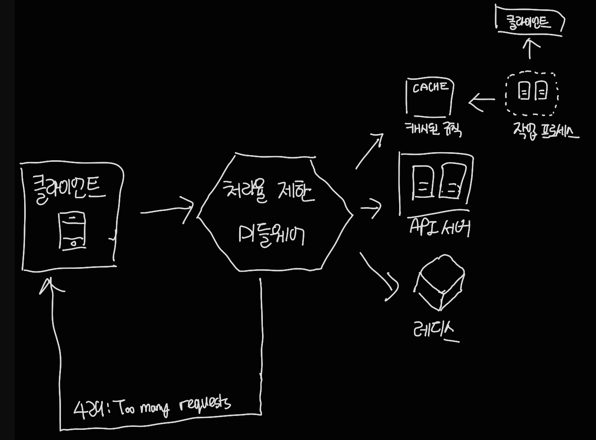

# 4장 처리율 제한 장치의 설계

처리율 제한 장치는 클라이언트 또는 서비스가 보내는 트래픽의 처리율을 제어하기 위한 장치이다.

특정 기간 내 전송되는 클라이언트의 요청 횟수를 제한한다.

##### 처리율 제한 장치를 두면 좋은 점

DoS 공격에 의한 자원 고갈을 방지할 수 있다.

비용을 절감할 수 있다

서버 과부하를 막는다.

 

### 1) 1단계 문제 이해 및 설계 범위 확정

- 설정된 처리율을 초과하는 요청은 정확하게 제한한다.
- 낮은 응답시간 : HTTP 응답 시간에 나쁜 영향을 주어서는 곤란하다.
- 가능한 적은 메모리를 써야 한다.
- 분산형 처리율 제한 : 하나의 처리율 제한 장치를 여러 서버나 프로세스에서 공유할 수 있어야 한다.
- 예외 처리 : 요청이 제한되었을 땐 사실을 사용자에게 분명히 보여줘야 한다.
- 높은 결함 감내성 : 제한 장치에 장애가 생기더라도 전체 시스템에 영향을 주어서는 안된다.

### 2) 2단계 개략적인 설계안 제시 및 동의 구하기

클라이언트는 일반적으로 처리율 제한을 안정적으로 걸 수 있는 장소가 아니다.

서버 측에 제한 장치를 둔다면, 처리율 제한 장치를 API 서버에 두는 방법이 있다.

다른 방법으로는 처리율 제한 장치를 API 서버에 두는 대신, 처리율 제한 미들웨어를 만들어 해당 미들웨어로 API 서버로 가는 요청을 통제하는 방법이 있다.

클라우드 마이크로서비스의 경우, 처리율 제한 장치는 보통 API 게이트웨이라 불리는 컴포넌트에 구현한다.

처리율 제한 장치를 서버에 두어야 하는지, 게이트웨이에 두어야 하는지 정답은 없다. 하지만 일반적으로 적용될 수 있는 몇 가지 지침은 다음과 같다.

- 프로그래밍 언어, 캐시 서비스 등 기술 스택을 점검하라
- 사업 필요에 맞는 처리율 제한 알고리즘을 찾아라
- 설계가 마이크로서비스에 기반하고 있고, API 게이트웨이를 이미 설계에 포함시켰다면 처리율 제한 기능 또한 게이트웨이에 포함시켜야 할 수도 있다.
- 처리율 제한 서비스를 직접 만드는 데는 시간이 들기 때문에 충분한 인력이 없다면 상용 API 게이트웨이를 쓰는 것이 바람직하다.

### 처리율 제한 알고리즘

##### 토큰 버킷

토큰 버킷은 지정된 용량을 갖는 컨테이너이며, 이 버킷에는 사전 설정된 양의 토큰이 주기적으로 채워진다. 토큰이 꽉 찬 버킷에는 더 이상의 토큰은 추가되지 않는다.

##### 누출 버킷

토큰 버킷 알고리즘과 비슷하지만 요청 처리율이 고정되어 있다는 점이 다르다.

##### 고정 윈도 카운터

타임라인을 고정된 가격의 윈도로 나누고, 각 윈도마다 카운터를 붙인다.

요청이 접수될 때마다 이 카운터의 값은 1씩 증가한다.

이 카운터의 값이 사전에 설정된 임계치에 도달하면 새로운 요청은 새 윈도가 열릴 때까지 버려진다.

##### 이동 윈도 로그

요청의 타임스탬프를 추적하고, 타임스탬프 데이터는 레디스의 정렬 집합 같은 캐시에 보관한다.

새 요청이 오면 만료된 타임스탬프를 제거한다.

새 요청의 타임스탬프롤 로그에 추가한다.

로그의 크기가 허용치보다 같거나 작을 때만 요청을 시스템에 전달하고, 그렇지 않으면 처리를 거부한다.

##### 이동 윈도 카운터

고정 윈도 카운터 알고리즘과 이동 윈도 로깅 알고리즘을 결합한 것이다.

### 개략적인 아키텍쳐

##### 동작 원리

클라이언트가 처리율 제한 미들웨어에게 요청을 보낸다.

처리율 제한 미들웨어는 레디스의 지정 버킷에서 카운터를 가져와서 한도에 도달했는지 아닌지를 검사한다.

한도에 도달하지 않았따면 요청은 API 서버로 전달된다. 미들웨어는 카운터의 값을 증가시킨 후 다시 레디스에 저장한다.

### 3) 3단계 상세 설계

개략적 설계를 봐서는 처리율 제한 규칙은 어떻게 만들어지고 어디에 저장되는지, 처리가 제한된 요청들은 어떻게 처리되는지에 대해서는 알 수 없다.

따라서 이 부분은 상세 설계를 통해서 알 수 있다.

처리율 제한 규칙은 디스크에 보관하고, 작업 프로세스는 수시로 규칙을 디스크에서 읽어 캐시에 저장한다.

처리율 제한에 걸리지 않은 경우에는 API 서버에 보내지만, 처리율 제한에 걸렸다면 429 에러를 클라이언트에 보낸다. 해당 요청은 그대로 버릴 수 있고 또 메세지 큐에 보관할 수 있다.

##### 분산 환경에서의 처리율 제한 장치의 구현을 위해서는, 경쟁 조건과 동기화 이슈에 대해서 고려가 필요하다.

##### 경쟁 조건

두 개 요청을 처리하는 스레드가 병렬로 카운터 값을 읽었으며 둘 가운데 어느 쪽도 아직 변경된 값을 저장하지 않은 상태일 때, 둘 다 다른 요청의 처리 상태를 고려하지 않고 양쪽에서 각각 1씩 더해 2가 더해지지 않고 1만 더해질 수 있다.

가장 널리 알려진 해결책은 락이지만 시스템의 성능을 상당히 떨어뜨린다는 문제가 있다. 다른 해결책은 루아 스크립트나 정렬 집합이라고 불리는 레디스 자료구조를 쓰는 방법이 있다. 

##### 동기화 이슈

고정 세션을 활용하여 같은 클라이언트로부터의 요청을 항상 같은 처리율 제한 장치로 보내는 방법이 있으나, 더 나은 해결책은 레디스와 같은 중앙 집중형 데이터 저장소를 쓰는 것이다.

### 4) 4단계 마무리

- 경성 또는 연성 처리율 제한
  - 경성 처리율 제한 : 요청의 개수는 임계치를 절대 넘어설 수 없다.
  - 연성 처리율 제한 : 요청의 개수는 잠시 동안은 임계치를 넘어설 수 있다.
- 다양한 계층에서의 처리율 제한
  - 현재 OSI 7계층 중 애플리케이션 계층에서의 처리율 제한에 대해서만 언급되어 있지만, IPTABLES를 사용하면 IP주소에 처리율 제한을 적용하는 것이 가능하다.
- 처리율 제한을 회피하는 방법
  - 클라이언트 측 캐시를 사용하여 API 호출 횟수를 줄인다
  - 처리율 제한의 임계치를 이해하고, 짧은 시간 동안 너무 많은 메세지를 보내지 않도록 한다.
  - 예외나 에러를 처리하는 코드를 도입하여 클라이언트가 예외적 상황으로부터 우아하게 복구될 수 있도록 한다.
  - 재시도 로직을 구현할 때는 충분한 백오프 시간을 둔다.