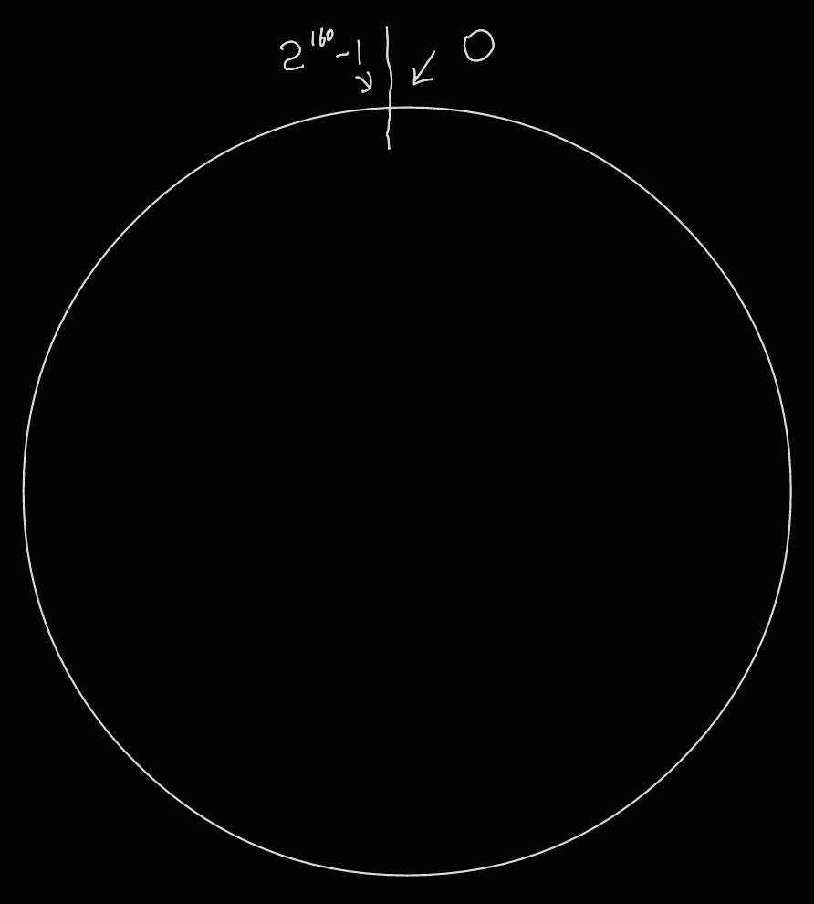
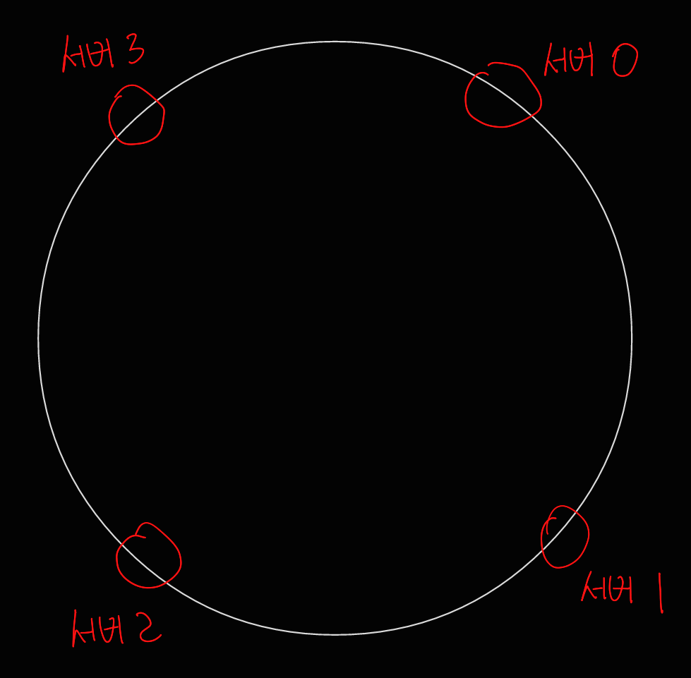
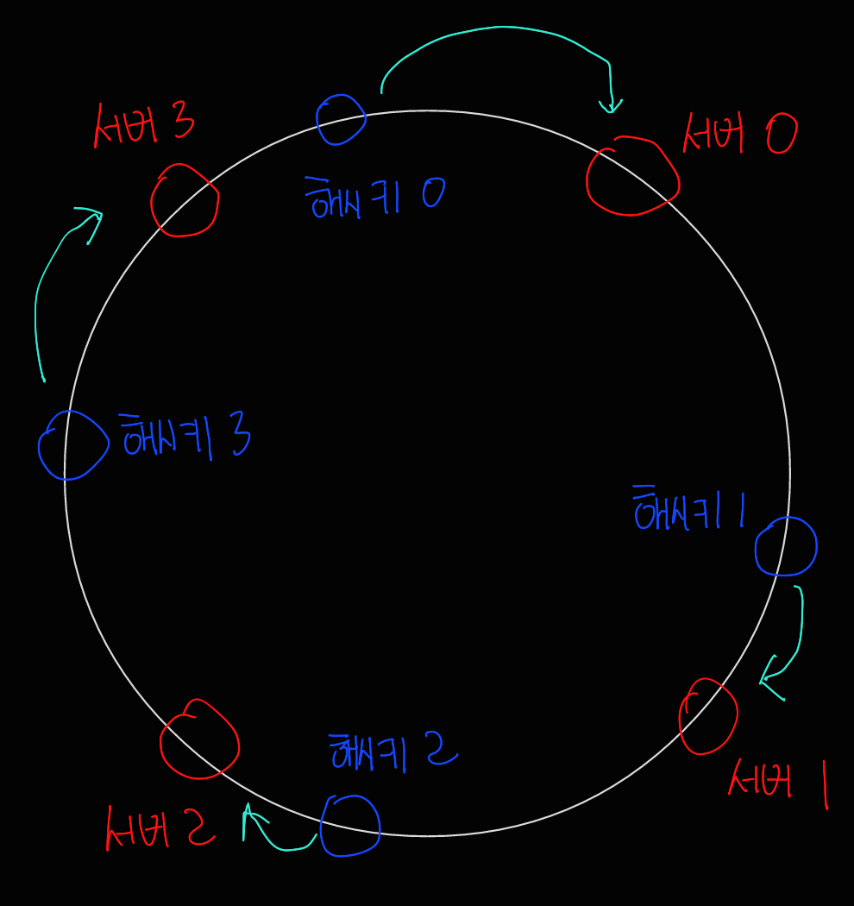
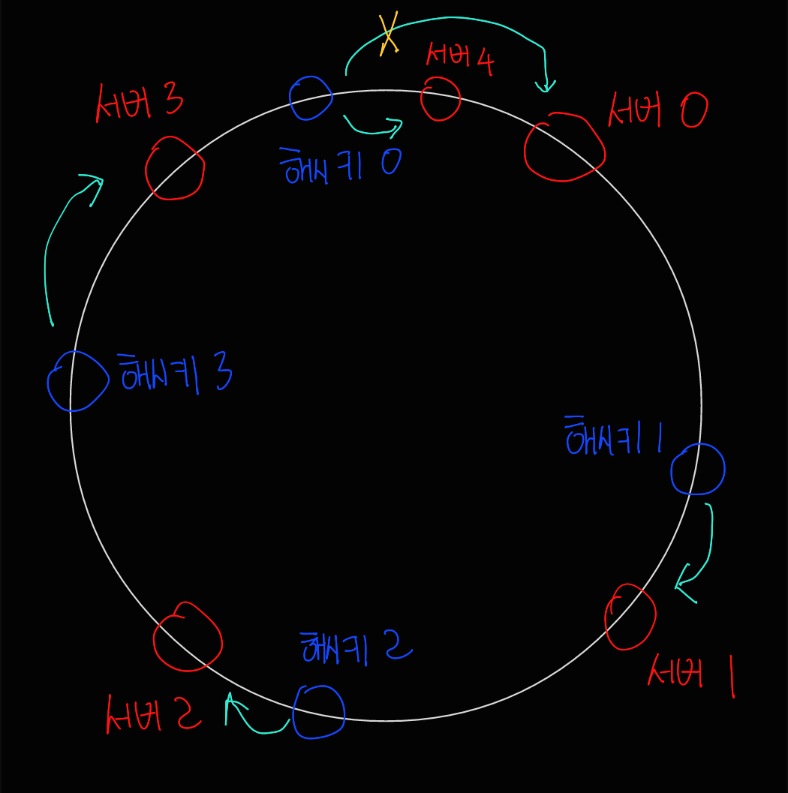
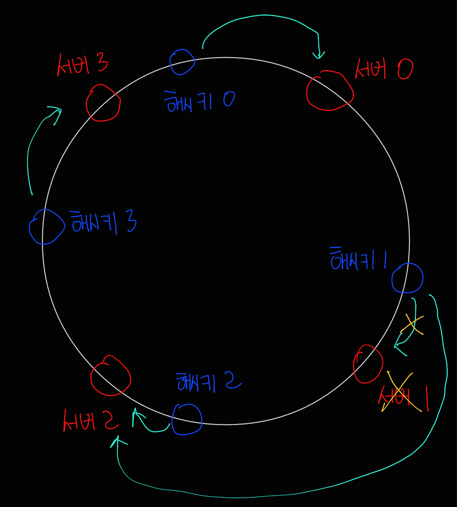
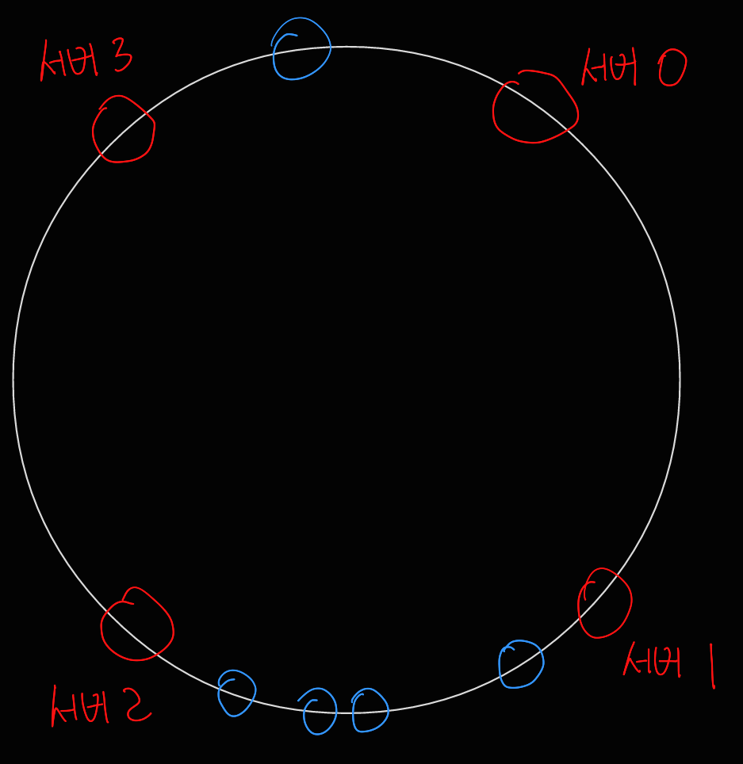
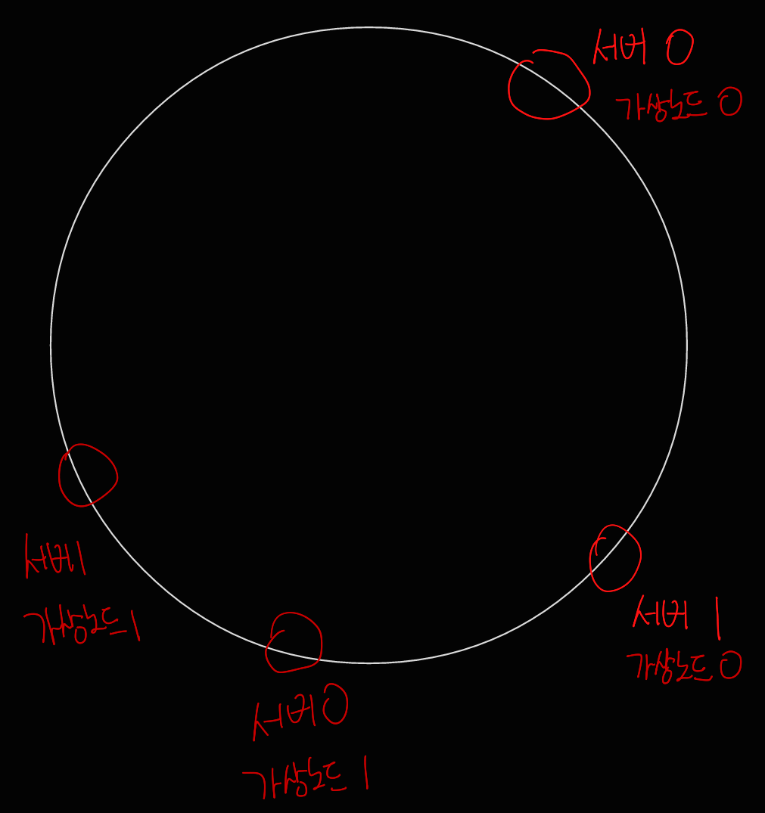
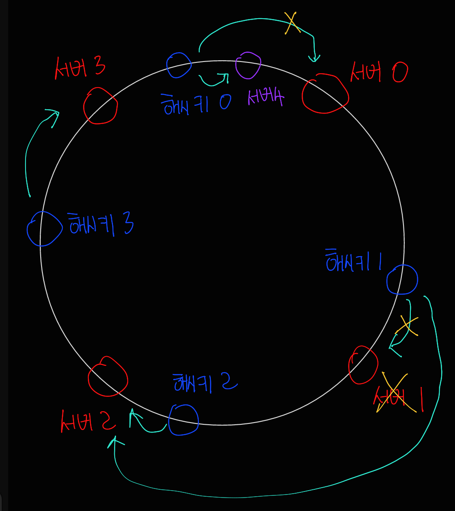

# 5장 안정 해시 설계

안정 해시는 수평적 규모 확장성을 달성하기 위해 요청 또는 데이터를 서버에 균등하게 나누도록 사용하는 기술이다.

 

### 해시 키 재배치 문제

N개의 캐시 서버가 있을 때, 부하를 균등하게 나누는 보편적 방법은 아래의 해시 함수를 사용한다.

serverIndex = hash(key) % 서버의 갯수

| 서버 인덱스 | 0              | 1              | 2              | 3              |
| ----------- | -------------- | -------------- | -------------- | -------------- |
| 서버        | server 0       | server 1       | server 2       | server 3       |
| 키          | key1 key3 | key0 key4 | key2 key6 | key5 key7 |

이 방법은 서버가 장애를 일으켜 동작을 중단했을 때, 키가 재분배되면서 캐시 클라이언트가 엉뚱한 서버에 접속하여 캐시 미스가 발생하게 될 가능성이 있다.

안정 해시는 이 문제를 효과적으로 해결하는 기술이다.

### 안정 해시

전통적 해시 테이블은 슬롯의 수가 바뀌면 거의 대부분 키를 재배치하나,

해시 테이블 크기가 조정될 때 평균적으로 오직 키의 개수(k)/슬롯의 개수(n)개의 키만 재배치하는 해시 기술이다.

##### 해시 공간과 해시 링

해시 링은 해시 공간을 링으로 표현한 것이다.

SHA-1 해시함수를 사용한다고 했을 때, 해시공간 범위는 0부터 2^160 - 1 까지이다.

이 해시공간을 링으로 표현하면 다음과 같다.

##### 해시 서버

해시 함수에서 서버를 링 위로 대응시킬 수 있다.

##### 해시 키

해시 키 또한 서버처럼 해시 링 위의 어떤 지점에 배치할 수 있다.

키가 저장되는 서버는, 해당 키의 위치로부터 시계 방향으로 링을 탐색해 나가면서 만나는 첫 번째 서버이다.

##### 서버 추가

서버를 추가하더라도, 키 가운데 일부만 재배치하면 된다.

하기 그림에서는 해시키 0만 기존 서버 0에서 새로 추가된 서버 4에 재배치된다.

다른 키들은 재배치되지 않는다.

##### 서버 제거

서버를 추가한 것과 마찬가지로, 하나의 서버가 제거되면 키 가운데 일부만 재배치된다.

서버 1이 삭제되었을 때 key1만이 서버 2로 재배치되고, 나머지 키에는 영향이 없다.

#### 기본 구현법의 두 가지 문제

지금까지 언급된 기본 구현법의 기본 절차는 다음과 같다.

- 서버와 키를 균등 분포 해시 함수를 사용해 해시 링에 배치한다.

  - 다만, 파티션의 크기를 균등하게 유지하는 것이 불가능하다.

- 키의 위치에서 링을 시계 방향으로 탐색하다 만나는 최초의 서버가 키가 저장될 서버이다.

  - 다만, 다음 그림처럼 키의 균등 분포를 달성하기 어렵다.

    

해당 문제들을 해결하기 위해 제안된 기법이 가상 노드라고 불리는 기법이다.

##### 가상 노드

하나의 서버를 링 위에 여러 개의 가상 노드를 가지게 하는 기법이다.

다음과 같이 1개의 서버에 여러 개의 가상 노드를 배치하면, 키의 방향으로부터 링을 탐색하다 만나는 최초의 가상노드에 키가 배치되어 가상 노드의 개수를 늘리면 키의 분포는 점점 더 균등해져서 데이터가 고르게 분포되게 된다.

##### 재배치할 키 결정

1. 보라색 서버 4가 추가되었다고 하면, 영향을 받은 범위는 서버 3부터 서버 4까지이고 해당 범위의 키를 서버 4에 재배치한다.

2. 주황색 서버 1이 삭제되었다고 하면 서버 1부터 반시계 방향에 있는 서버 0 사이에 있는 키들이 서버 2에 재배치되어야 한다.

요약하자면 다음과 같다.

- 서버가 추가되거나 삭제될 때 재배치되는 키의 수가 최소화된다.
- 데이터가 보다 균등하게 분포하게 되므로 수평적 규모 확장성을 달성하기 쉽다.
- 핫스팟 키 문제를 줄인다.

안정 해시는 데이터 파티셔닝, 채팅 어플리케이션, 부하 분산기 등 많은 곳에서 활용되고 있다.