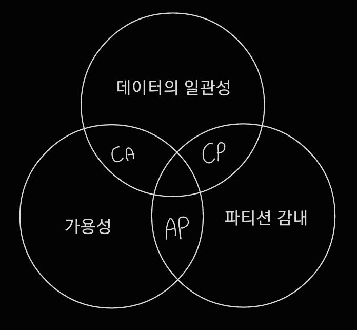
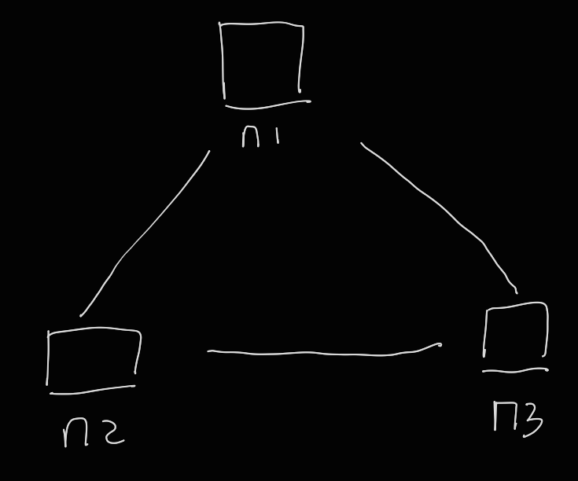
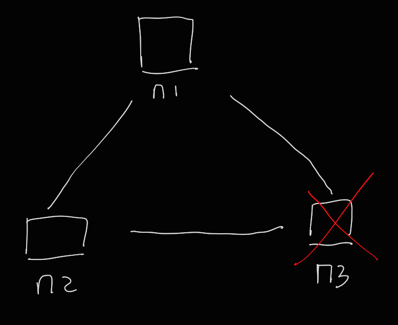
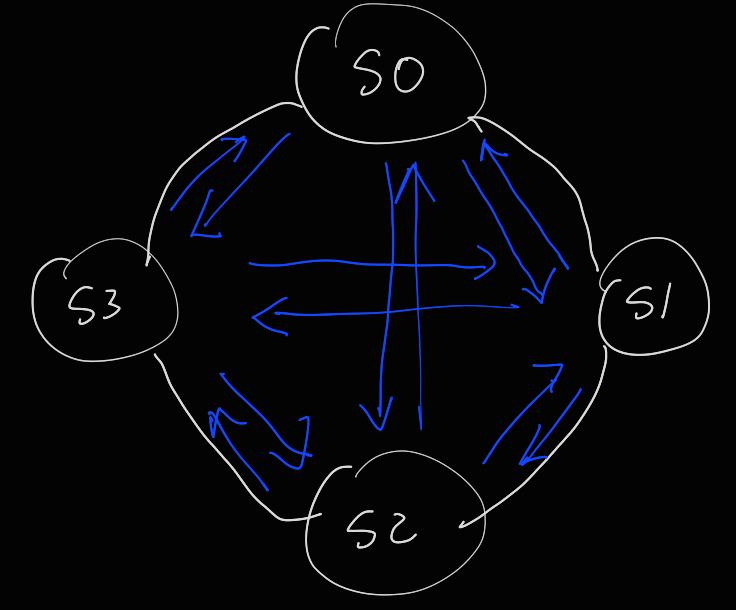
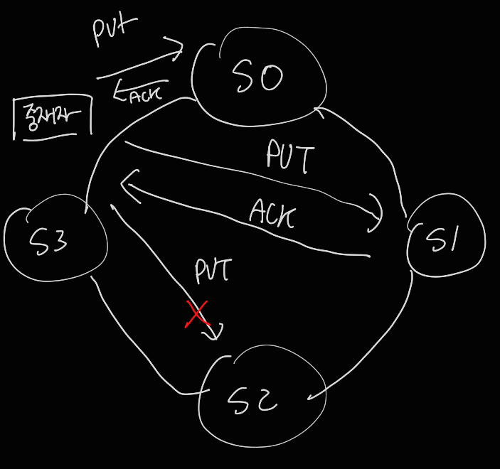
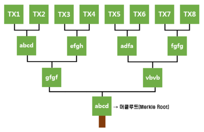

# 6장 키-값 저장소 설계

키-값(key-value) 저장소는 키-값 데이터베이스라고도 불리는 비 관계형(Non-Relational) 데이터베이스이다.

> ###### 대표적으로는 Redis, 아마존 다이나모, memcached 등이 있다.

이 저장소에 저장되는 값은 고유 식별자(identifier)를 키로 가져야 한다.

키와 값 사이에 연결 관계를 "키-값" 쌍이라고 지칭한다.

키-값 쌍에서 키는 유일해야 하며 해당 키의 값은 키를 통해서만 접근할 수 있다.

키-값 저장소의 value는 어떤 type이라도 상관하지 않는다.

#####  예시

| 키   | 값    |
| ---- | ----- |
| 145  | john  |
| 147  | bob   |
| 170  | julia |

이번 장에서는 put(key, value), get(key) 연산을 지원하는 키-값 저장소를 설계한다.

### 요약

| 목표/문제                         | 기술                                       |
| --------------------------------- | ------------------------------------------ |
| 대규모 데이터 저장                | 안정 해시를 사용해 서버들에 부하 분산      |
| 읽기 연산에 대한 높은 가용성 보장 | 데이터를 여러 데이터센터에 다중화          |
| 쓰기 연산에 대한 높은 가용성 보장 | 버저닝 및 벡터 시계를 사용한 충돌 해소     |
| 데이터 파티션                     | 안정 해시                                  |
| 점진적 규모 확장성                | 안정 해시                                  |
| 다양성                            | 안정 해시                                  |
| 조절 가능한 데이터 일관성         | 정족수 합의                                |
| 일시적 장애 처리                  | 느슨한 정족수 프로토콜과 단서 후 임시 위탁 |
| 영구적 장애 처리                  | 머클 트리                                  |
| 데이터 센터 장애 대응             | 여러 데이터 센터에 걸친 데이터 다중화      |

### 문제 이해 및 설계 범위 확정

이번 장에서는 다음 특성을 갖는 키-값 저장소를 설계한다.

- 키-값 쌍의 크기는 10KB 이하이다.

- 큰 데이터를 저장할 수 있어야 한다.

- 높은 가용성을 제공해야 한다. 시스템이 설사 장애가 있더라도 빨리 응답해야 한다.

- 높은 규모 확장성을 제공해야 한다. 트래픽 양에 따라 자동적으로 서버 증설/삭제가 이루어져야 한다.

- 데이터 일관성 수준은 조정이 가능해야 한다.

- 응답 지연시간이 짧아야 한다.

  

### 단일 서버 키-값 저장소

한 대 서버만 사용하는 키-값 저장소를 설계하는 것은 쉽다.

가장 직관적인 방법은 키-값 쌍 전부를 메모리에 해시 테이블로 저장하는 것이다.

그러나 이 접근법은 빠른 속도를 보장하긴 하지만 모든 데이터를 메모리 안에 두는 것이 불가능하다는 약점이 있다.

이 문제를 해결하기 위해서는

- 데이터 압축
- 자주 쓰이는 데이터만 메모리에 두고 나머지는 디스크에 저장

다만 이렇게 개선한다고 해도 한 대 서버로 부족한 때가 있다.

많은 데이터를 저장하려면 분산 키-값 저장소를 만들 필요가 있다.

### 분산 키-값 저장소

분산 시스템을 설계할 때에는 CAP 정리를 이해하고 있어야 한다.

##### CAP 정리

데이터 일관성, 가용성, 파티션 감내라는 세 가지 요구사항을 동시에 만족하는 분산 시스템을 설계하는 것은 불가능하다는 것이다.

- 데이터 일관성 : 분산 시스템에 접속하는 클라이언트는 어떤 노드에 접속했더라도 같은 데이터를 봐야 한다.
- 가용성 : 분산 시스템에 접속하는 클라이언트는 일부 노드에 장애가 발생하더라도 항상 응답을 받을 수 있어야 한다.
- 파티션 감내 : 파티션은 두 노드 사이에 통신 장애가 발생했음을 의미한다. 네트워크에 파티션이 생기더라도 시스템은 계속 동작해야 한다는 것을 뜻한다.

CAP 정리는 두 가지를 충족하려면 나머지 하나는 반드시 희생되어야 한다는 것을 의미한다.

- CP 시스템 : 가용성을 희생하고 일관성과 파티션 감내를 지원하는 키-값 저장소
- AP 시스템 : 데이터 일관성을 희생하고 가용성과 파티션 감내를 지원하는 키-값 저장소
- CA 시스템 : 파티션 감내를 희생하고 가용성과 일관성을 지원하는 키-값 저장소. 하지만 네트워크 장애는 피할 수 없는 일이므로, 분산 시스템은 반드시 파티션 문제를 감내할 수 있도록 설계되어야 한다. 그러므로 실세계에 CA 시스템은 존재하지 않는다.

몇 가지 구체적인 사례로 분산 시스템에서 데이터는 보통 여러 노드에 복제되어 보관된다.

세 대의 복제 노드 n1, n2, n3에 데이터를 복제하여 보관하는 상황을 가정해 보자

##### 이상적 상태

이상적 환경이라면 네트워크가 파티션되는 상황은 일어나지 않을 것이다. n1에 기록된 데이터는 자동적으로 n2와 n3에 복제된다. 데이터 일관성과 가용성도 만족된다.

##### 실세계의 분산 시스템

분산 시스템은 파티션 문제를 피할 수 없다. 그리고 파티션 문제가 발생하면 우리는 일관성과 가용성 사이에서 하나를 선택해야 한다.

만일 아래 그림처럼 n3에 장애가 발생했다면, n1 또는 n2에 기록된 데이터는 n3에 전달되지 않는다. n3에 기록되었으나 아직 n1 및 n2로 전달되지 않은 데이터가 있다면 n1과 n2는 오래된 사본을 가지고 있을 것이다.

### 시스템 컴포넌트

키-값 저장소 구현에 사용될 핵심 컴포넌트 및 기술들은 다음과 같다.

- 데이터 파티션
- 데이터 다중화
- 일관성
- 일관성 불일치 해소
- 장애 처리
- 시스템 아키텍쳐
- 쓰기 경로
- 읽기 경로

##### 데이터 파티션

대규모 애플리케이션의 경우 전체 데이터를 한 대 서버에 욱여넣는 것은 불가능하기 때문에,

단순한 해결책은 데이터를 작은 파티션으로 분할한 다음 여러 대 서버에 저장하는 것이다.

데이터를 파티션 단위로 나눌 때에는 다음 문제들을 따져야 한다.

- 데이터를 여러 서버에 고르게 분산할 수 있는가

- 노드가 추가되거나 삭제될 때 데이터의 이동을 최소화 할 수 있는가

  

##### 데이터 다중화

높은 가용성과 안정성을 확보하기 위해 데이터를 N개 서버에 비동기적으로 다중화 할 필요가 있다.

안정성을 담보하기 위해 데이터의 사본은 다른 센터의 서버에 보관하고, 센터들은 고속 네트워크에 연결한다.

##### 일관성

여러 노드에 다중화 된 데이터는 적절히 동기화가 되어야 한다.

정족수 합의 프로토콜을 사용하면 읽기/쓰기 연산 모두에 일관성을 보장할 수 있다.

관계된 정의는 다음과 같다.

N = 사본 개수

W = 쓰기 연산에 대한 정족수. 적어도 W개 서버로부터 쓰기 연산이 성공했다는 응답을 받아야 한다.

R = 읽기 연산에 대한 정족수. 적어도 R개 서버로부터 읽기 연산이 성공했다는 응답을 받아야 한다.

W=1 또는 R=1의 구성일 경우 응답 속도는 빠르지만 데이터 일관성이 보장되지 않을 것이다.

W나 R이 커질수록 응답 속도는 느리지만 강한 일관성이 보장된다.

##### 일관성 불일치 해소

> ##### 데이터 버저닝 (versioning) 
>
> 데이터를 변경할 때마다 데이터의 새로운 버전을 만드는 것을 의미한다.
>
> 따라서 각 버전의 데이터는 변경 불가능하다.

> ##### 벡터 시계
>
> 어떤 버전 X가 버전 Y의 이전 버전인지 쉽게 판단할 수 있다.

##### 장애 처리

장애 처리를 위해서는 장애 감지 기법과 장애 해소 전략이 필요하다..

###### 장애 감지

모든 노드 사이에 멀티캐스팅 채널을 구축하는 것이 서버 장애를 감지하는 가장 효과적인 방법이지만, 비효율적이다.

따라서 가십 프로토콜 같은 분산형 장애 감지 솔루션을 채택하는 것이 효율적이다.

##### 장애 해소

###### 일시적 장애 처리

엄격한 정족수 접근법을 쓴다면 읽기와 쓰기 연산을 아예 금지해야 할 것이지만, 

느슨한 정족수 접근법은 장애 서버를 무시하고 W개의 건강한 서버와 R개의 건강한 서버를 해시 링에서 고른다.

###### - 단서 후 임시 위탁 (hinted handoff)

네트워크나 서버 문제로 장애 상태인 서버로 가는 요청은 다른 서버가 잠시 맡아 처리한다. 그동안 발생한 변경사항은 해당 서버가 복구되었을 때 일괄 반영하여 데이터 일관성을 보존한다. 이를 위해 임시로 쓰기 연산을 처리한 서버에서는 그에 관한 단서(hint)를 남겨둔다. 이런 장애 처리 방안을 단서 후 임시 위탁 기법이라 부른다.

노드 s2에 장애가 발생했다면 읽기 및 쓰기 연산을 일시적으로 노드 s3가 처리하고, s2가 복구되면 s3는 갱신된 데이터를 s2로 인계한다.

 

###### 영구 장애 처리

반-엔트로피 프로토콜을 구현하여 사본들을 동기화한다. 이 프로토콜은 사본을 비교하여 최신 버전으로 갱신하는 과정을 포함한다.

사본 간 일관성이 망가진 상태를 탐지하고 전송 데이터의 양을 줄이기 위해서는 머클 트리를 사용한다.

머클트리(Merkle Tree)는 블록에 포함된 거래 내역을 나무 형태로 요약한 것이다. 1979년 머클트리를 개발한 랄프 머클(Ralph Merkle)의 이름을 따서 머클트리라고 부르며 해시트리(Hash Tree), 혹은 이진트리(Binary Tree)라고도 한다.

##### 시스템 아키텍쳐

아키텍처의 주된 기능은 다음과 같다.

- 클라이언트는 key-value 저장소가 제공하는 두 가지 단순한 API, 즉 get(key) 및 put(key, value)와 통신한다.

- 중재자는 클라이언트들에게 키-값 저장소에 대한 프락시 역할을 하는 노드다

- 노드는 안정 해시의 해시 링 위에 분포한다.

- 노드를 자동으로 추가 또는 삭제할 수 있도록, 시스템은 완전히 분산된다.

- 데이터는 여러 노드에 다중화된다.

- 모든 노드가 같은 책임을 지므로, SPOF는 존재하지 않는다.

  

##### 쓰기 경로

쓰기 요청이 특정 노드에 전달되면 다음과 같은 일이 벌어질 것이다.

1. 쓰기 요청이 커밋 로그 파일에 기록된다.

2. 데이터가 메모리 캐시에 기록된다.

3. 메모리 캐시가 가득차거나 임계치에 도달하면 데이터는 디스크에 있는 SSTable에 기록된다.

   

##### 읽기 경로

읽기 요청을 받은 노드는 데이터가 메모리 캐시에 있는지부터 살핀다.

데이터가 메모리에 없다면 디스크에서 가져와야 한다. 읽기 연산이 처리되는 경로는 다음과 같다.

1. 데이터가 메모리 있는지 검사한다.
2. 데이터가 메모리에 없다면, 블룸 필터(Bloom Filter)를 검사한다.
3. 블룸 필터를 통해 어떤 SSTable에 키가 보관되어 있는지 알아낸다.
4. SSTable에서 데이터를 가져온다.
5. 해당 데이터를 클라이언트에게 반환한다.